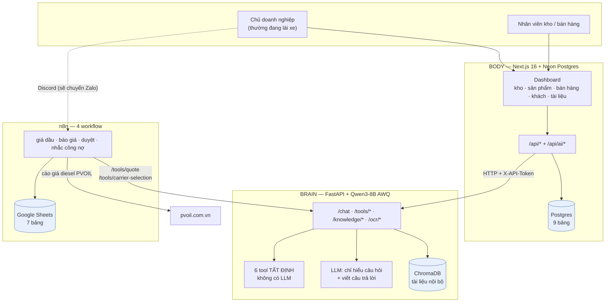
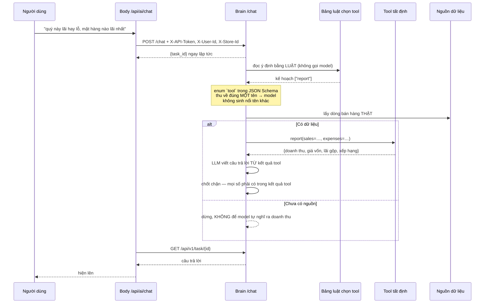
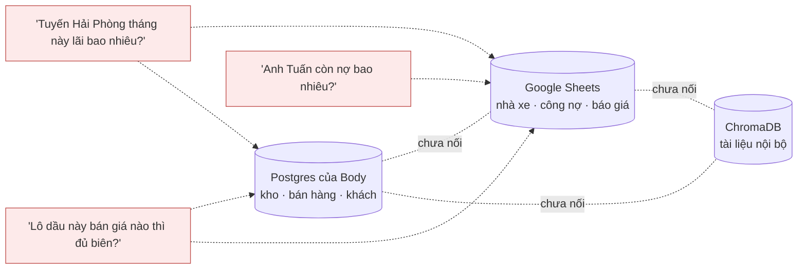
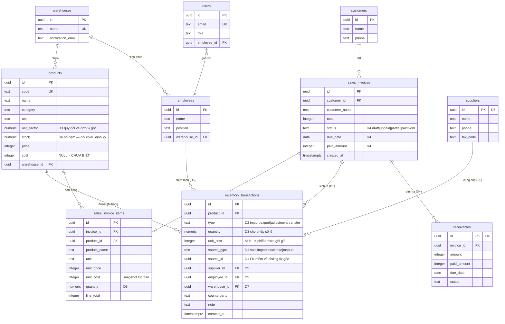

# Hạ tầng ANSER và đề xuất ERD v3

> Gửi đội Body — 06/08/2026
> Nhánh `feat/brain-integration` (fork `PCBoiz/ANSER-v2-Brain`), tách từ `e5dc346`.
> **Repo gốc `Dgsonn/ANSER-v2` không bị đụng tới** — kiểm bằng `git ls-remote` trước và sau mỗi lần push.

Tài liệu này có ba phần:

1. **Toàn cảnh hạ tầng** — bốn thành phần, dữ liệu chảy thế nào
2. **Đã cải tiến gì từ bản gốc** — kèm số commit và dòng code
3. **ERD v3 đề xuất** — mỗi thay đổi kèm *"không sửa thì hỏng ở đâu"*

Phần 3 là phần cần các bạn duyệt hoặc bác. Mỗi đề xuất viết rời để bác được từng
điểm, không phải nhận/từ chối cả gói.

---

## 1. Toàn cảnh hạ tầng

### 1.1. Bốn thành phần



### 1.2. Ranh giới trách nhiệm

| Thành phần | Giữ dữ liệu gì | Ai sở hữu |
|---|---|---|
| **Body** | kho, sản phẩm, bán hàng, khách hàng, nhân sự, tài liệu | đội Body |
| **Brain** | không giữ trạng thái nghiệp vụ — chỉ ChromaDB cho tài liệu | đội Brain |
| **n8n + Sheets** | nhà xe, tuyến, báo giá, công nợ, giá dầu | vận hành |

**Nguyên tắc bên Brain:** LLM chỉ làm hai việc — hiểu câu hỏi tiếng Việt, và
viết câu trả lời từ kết quả có sẵn. **Mọi phép tính nằm trong tool thuần.** Trước
khi câu trả lời ra khỏi Brain, một chốt chặn soi lại từng con số trong đó; số nào
không có trong dữ liệu gốc thì chặn cả câu trả lời.

Nghĩa là Body **không cần tin LLM** để tin con số. Con số đến từ `/tools/*` —
những hàm thuần, không LLM, có test.

### 1.3. Một câu hỏi đi qua hệ thống thế nào



Điểm đáng chú ý cho đội Body: **nhánh `else`**. Khi chưa có nguồn dữ liệu, hệ
thống dừng và nói thẳng, thay vì để model điền `arguments` bằng số nó tự nghĩ ra.
Nếu để model bịa dữ liệu đầu vào thì mọi con số sau đó đều *"có nguồn"* và đi lọt
hết chốt chặn.

### 1.4. Vấn đề lớn nhất hiện nay: ba kho dữ liệu không nói chuyện với nhau



Ba câu hỏi trên **hôm nay chưa ai trả lời được, dù dữ liệu đã có đủ** — chúng cần
số nằm ở hai kho khác nhau. Đây là lý do phần lớn đề xuất ở mục 3 hướng về việc
**nối lại**, không phải thêm tính năng.

---

## 2. Đã cải tiến gì từ bản gốc

Bảy commit trên `feat/brain-integration`, tính từ `e5dc346`.

| Commit | Việc |
|---|---|
| `eed250e` | Bịt lỗ hổng secret ở gốc repo + sửa đường dẫn `drizzle.config` |
| `fc59f30` | **Ba cột giá vốn** — NULLABLE có chủ đích |
| `b7f085a` | Client gọi Brain + ba route `/api/ai` (health, chat, report) |
| `84c3c13` | Ba đường nạp giá vốn: từ file N-X-T, từ phiếu nhập, từ form sản phẩm |
| `6cdf92a` | Khung chat, bảng lãi gộp, tab kiểm số kho từ Excel |
| `d1a0e67` | Đường nạp tài liệu nội bộ + đọc hoá đơn nhà xe từ ảnh |
| `9000cfc` | Khoá kho tri thức tách khỏi kho hàng |

Ba việc dưới đây đáng nói riêng.

### 2.1. `eed250e` — `.env.local` ở gốc repo không được gitignore

Trước commit này, `.env.local` nằm ở **gốc repo** và **không có `.gitignore` nào ở
gốc**. Một lệnh `git add .` là commit thẳng `JWT_SECRET` và `DATABASE_URL` lên
GitHub.

Thêm nữa file đó đặt sai chỗ: Next.js đọc `.env.local` trong `frontend/`, nên các
biến trong đó **chưa từng có tác dụng**.

### 2.2. `fc59f30` — ba cột giá vốn, NULLABLE có chủ đích

```
products.cost
inventory_transactions.unit_cost
sales_invoice_items.unit_cost
```

**`NULL` = CHƯA BIẾT, khác hẳn `0` = "hàng không tốn đồng nào".**

Không có phân biệt này thì báo cáo lãi lỗ coi mọi mặt hàng chưa nhập giá vốn là
**lãi 100%** — con số sai mà nghe rất xuôi tai, đúng loại lỗi không ai phát hiện
tới lúc quyết toán.

`sales_invoice_items.unit_cost` là **snapshot tại thời điểm bán**, cùng lý do với
`unit_price` và `product_name` mà bản gốc đã snapshot sẵn: giá vốn đổi theo từng
lô nhập, nhưng lãi gộp của hoá đơn cũ phải giữ nguyên.

> Đây là điểm ERD v2 (bản vẽ hiện tại) **chưa có**. Nếu vẽ lại theo v2 và bỏ cột
> này, báo cáo lãi gộp sẽ lấy giá vốn **hôm nay** áp cho hoá đơn **quý trước**.

`inventory_transactions.unit_cost` là nguồn giá vốn **đáng tin nhất**: nó gắn với
một lô cụ thể, không phải con số bình quân trôi theo thời gian như `products.cost`.

Xem [`store/sales.ts`](frontend/src/server/store/sales.ts) — dòng ghi phiếu xuất
có ghi chú: *"`unitCost` LUÔN là giá vốn, kể cả ở dòng xuất — không bao giờ là giá
bán. Ghi giá bán vào đây là biến sổ kho thành sổ doanh thu."*

### 2.3. `9000cfc` — khoá kho tri thức tách khỏi kho hàng

Bản đầu lấy `warehouses[0].id` làm khoá phạm vi tài liệu. Nhưng lúc chat, Body gửi
**kho đang chọn** (`X-Store-Id`), không phải kho đầu tiên.

Hậu quả: đứng ở kho thứ hai mà hỏi thì mọi tài liệu đã nạp trở nên **vô hình** —
không lỗi, không cảnh báo, trang Tài liệu vẫn liệt kê đủ.

Nay dùng `BRAIN_KB_WORKSPACE` (mặc định `"default"`), khớp `KB_WORKSPACE_ID` bên
Brain. Lệch khoá thì Brain ghi cảnh báo gọi đích danh cả hai biến.

---

## 3. ERD v3 đề xuất

### 3.1. Trước hết: bản vẽ và code đang lệch nhau

Không phải chê trách — lệch là chuyện bình thường khi code chạy trước bản vẽ.
Nhưng không nói ra thì bản vẽ thành vô dụng.

| Bản vẽ ERD v2 | Code thật (`server/db/schema.ts`) |
|---|---|
| `StockMovement` có `supplier_id`, `customer_id`, `employee_id`, `total_cost` | `inventory_transactions` chỉ có `counterparty` (text tự do) + `unit_cost` |
| `Inventory` là bảng riêng, có `average_cost` | Không tồn tại — số lượng nằm ở `products.stock` |
| `Supplier` là bảng riêng | Không tồn tại |
| `Workflow` + `WorkflowExecution` | `automation_rules` + cột `n8n_workflow_id` |
| `Category` là bảng riêng, có FK | `products.category` là **text** |
| `User.linked_to_employee_id` **và** `Employee.user_id` | Chỉ `users.employee_id` — một chiều |
| `StockMovement.type` gồm Import/Export/Sale/Adjustment | Chỉ `"import"` \| `"export"` |
| Không có giá vốn tại thời điểm bán | **Có** — `sales_invoice_items.unit_cost` (`fc59f30`) |

Hai dòng cuối đáng chú ý ngược chiều nhau: một chỗ bản vẽ đi trước code
(`Adjustment`), một chỗ code đi trước bản vẽ (giá vốn).

**Điểm v1 → v2 làm đúng:** gộp `ImportTransaction`/`ExportTransaction` thành một
sổ duy nhất. Đó là mẫu chuẩn cho sổ kho, và code thật đã theo hướng đó từ đầu.

**Điểm v2 còn giữ:** `Inventory` vẫn là bảng riêng bên cạnh sổ giao dịch → vẫn hai
nguồn sự thật cho cùng một con số. Xem đề xuất **D6**.

### 3.2. ERD v3



### 3.3. Bảy đề xuất — mỗi cái kèm "không sửa thì hỏng ở đâu"

Xếp theo mức thiệt hại, không theo độ khó.

---

#### D1 · Nối phiếu kho về chứng từ gốc

**Thêm:** `inventory_transactions.source_type` + `source_id`

Hiện tại [`store/sales.ts`](frontend/src/server/store/sales.ts) ghi phiếu xuất với
`counterparty: input.customerName` và `note: "Xuất theo hoá đơn bán hàng"` — **không
có ID hoá đơn**.

**Không sửa thì hỏng ở đâu:** hai khách trùng tên là đối chiếu không ra. Muốn biết
"hoá đơn HD-042 đã xuất đủ hàng chưa" thì phải dò theo tên và thời gian. Và khi
huỷ một hoá đơn, không có cách nào tìm đúng phiếu kho để đảo lại.

Đây cũng là điều kiện để trả lời *"tuyến/khách nào đang chiếm nhiều hàng nhất"*.

---

#### D2 · Thêm `adjustment` và `transfer` vào `type`

**Sửa:** `type` hiện chỉ `"import" | "export"`

**Không sửa thì hỏng ở đâu:** kiểm kê phát hiện thiếu 3 thùng thì **không có cách
nào ghi đúng**. Người dùng sẽ tạo một phiếu nhập/xuất giả để cho số khớp — và từ
đó sổ nhập-xuất vĩnh viễn sai, trong khi số tồn thì đúng.

Bộ soi lỗi sổ sách bên Brain có phép kiểm `ĐK + Nhập − Xuất = CK`. Nếu người dùng
buộc phải ghi phiếu giả, phép kiểm đó mất tác dụng — nó sẽ luôn cân, vì cái sai đã
được nhét vào chính hai vế.

`transfer` cần cho D7.

---

#### D3 · `quantity` phải là `numeric`, không phải `integer`

**Sửa:** `inventory_transactions.quantity`, `sales_invoice_items.quantity`

**Không sửa thì hỏng ở đâu:** dầu nhờn bán theo **lít**. Bán 2,5 lít thì hoặc
không ghi được, hoặc bị cắt còn 2 — **tính thiếu tiền, và tính thiếu thì không bên
nào kêu**.

Bên Brain vừa dính đúng lỗi này ở tầng tính toán hôm 06/08: `int(2.5)` cho ra `2`
trong lớp kiểm tổng hoá đơn, sửa rồi. Nhưng ở tầng DB thì đây là **ràng buộc
cứng** — sửa ở Brain không cứu được.

Đề xuất kèm: thêm `products.unit_factor` để quy đổi về đơn vị gốc (1 phuy = 200
lít). Sai quy đổi phuy ↔ lít là một trong những nguyên nhân tồn kho âm hay gặp
nhất ở ngành này.

---

#### D4 · Công nợ vào DB, không để riêng ở Google Sheet

**Thêm:** bảng `receivables`, hoặc tối thiểu `sales_invoices.status` + `due_date` +
`paid_amount`

Hiện n8n đã có sheet `Receivables` với đúng các cột `amount / due_date /
paid_amount / status`, và một workflow nhắc quá hạn thứ 2 hàng tuần. Nhưng Postgres
không có gì tương ứng.

**Không sửa thì hỏng ở đâu:** hai nguồn công nợ không khớp nhau. Bán hàng ghi ở
Body, công nợ ghi ở Sheet — ai nhớ thì ghi, quên thì thôi. Và câu *"anh Tuấn còn
nợ bao nhiêu"* không trả lời được từ chat, dù số liệu tồn tại.

Với công ty 4–5 người, dòng tiền là chuyện sống còn — đây là đề xuất bên Brain cho
là đáng giá nhất.

---

#### D5 · `suppliers` thành bảng, `employee_id` trên phiếu kho

**Thêm:** bảng `suppliers`; `inventory_transactions.supplier_id`, `employee_id`

Bản vẽ v2 ghi chú *"ANSER-v2 đang không có chức năng lưu thông tin bên cung cấp,
bảng này có thể không cần"*. Bên Brain đề nghị **giữ**.

**Không sửa thì hỏng ở đâu:** phép kiểm "giá nhập nhảy vọt" chỉ có ích khi trả lời
được *"nhà cung cấp nào tăng giá"*. Với `counterparty` là chữ tự do, "Cty ABC",
"ABC", "abc trading" là ba nhà cung cấp khác nhau.

`employee_id` để biết ai ghi phiếu — cần khi đối chiếu chênh lệch kiểm kê.

---

#### D6 · `products.stock` là số đệm — cần đường đối chiếu

**Không đổi lược đồ.** Đề xuất một hàm dựng lại + một phép kiểm định kỳ.

`products.stock` suy ra được từ `inventory_transactions`, nhưng đang lưu riêng và
cập nhật bằng `SET stock = stock - quantity`. Hai nguồn có thể lệch: một lần lỗi
giữa chừng, một lần sửa tay, là lệch vĩnh viễn không ai biết.

**Không sửa thì hỏng ở đâu:** đây **đúng loại lỗi mà bộ soi bên Brain bán khả năng
phát hiện** — sẽ hơi ngượng nếu chính hệ thống của mình sinh ra nó.

Đề xuất tối thiểu: một endpoint `POST /api/inventory/reconcile` tính lại tồn từ sổ
giao dịch và báo mã nào lệch. Không cần tự sửa — chỉ cần **nhìn thấy**.

---

#### D7 · `warehouse_id` nên nằm trên phiếu kho, không chỉ trên sản phẩm

**Thêm:** `inventory_transactions.warehouse_id`

Hiện `warehouse_id` nằm trên `products` và `NOT NULL`. Nghĩa là **một mã hàng
thuộc đúng một kho**.

**Không sửa thì hỏng ở đâu:** cùng một loại dầu để ở hai kho thì phải tạo hai mã
hàng khác nhau. Từ đó: tồn kho tổng phải cộng tay, báo cáo lãi lỗ tách đôi một mặt
hàng, và không chuyển kho được.

Enum `Employee.manage_inventory` trong bản vẽ có "Kho 1 / Kho 2 / Kho 3" — nên
nhiều kho là chuyện đã tính tới. Chỉ là lược đồ chưa đỡ được.

Đây là đề xuất **ảnh hưởng nhiều dữ liệu nhất**, và cũng là cái duy nhất bên Brain
thấy có thể hoãn nếu pilot chỉ dùng một kho.

---

### 3.4. Chưa đề xuất lần này: phần vận tải

Hoàng Phát làm **hai nghề**: phân phối dầu nhờn và nhận vận chuyển. Lược đồ hiện
tại phủ nghề thứ nhất. Nghề thứ hai (chuyến xe, nhà xe, tuyến, báo giá, phụ phí
phát sinh) đang nằm hoàn toàn ở Google Sheets.

Bên Brain **chưa đề xuất đưa vào Postgres lần này** — cần thống nhất trước xem
Sheets là giải pháp tạm hay lâu dài. Nếu lâu dài thì cần một đường đọc từ Brain
sang Sheets; nếu tạm thì nên tính vào ERD v4.

Đây là câu hỏi kiến trúc, không phải câu hỏi lược đồ — nên để lại bàn riêng.

---

## 4. Tóm tắt

| Đề xuất | Thiệt hại nếu không làm | Ảnh hưởng dữ liệu cũ |
|---|---|---|
| **D1** nối phiếu kho ↔ chứng từ | không đối chiếu được, huỷ hoá đơn không đảo được kho | thấp — thêm cột nullable |
| **D2** thêm `adjustment` | kiểm kê phải ghi phiếu giả → sổ sai vĩnh viễn | không |
| **D3** `quantity` số lẻ | bán theo lít bị cắt cụt → tính thiếu tiền | trung bình — đổi kiểu cột |
| **D4** công nợ vào DB | hai nguồn không khớp; không tra được từ chat | thấp — bảng mới |
| **D5** `suppliers` + `employee_id` | không truy được nhà cung cấp nào tăng giá | thấp |
| **D6** đối chiếu tồn kho | tồn lệch âm thầm | không — chỉ thêm endpoint |
| **D7** kho trên phiếu | không chuyển kho, không gộp tồn | **cao** — có thể hoãn |

Bên Brain đề nghị làm **D1, D2, D3, D4** trước — bốn cái này ảnh hưởng dữ liệu cũ
ít mà mở khoá được nhiều nhất.

Có chỗ nào các bạn thấy không hợp lý hoặc đã có cách giải khác, cứ bác thẳng —
đây là đề xuất để bàn, không phải yêu cầu.
