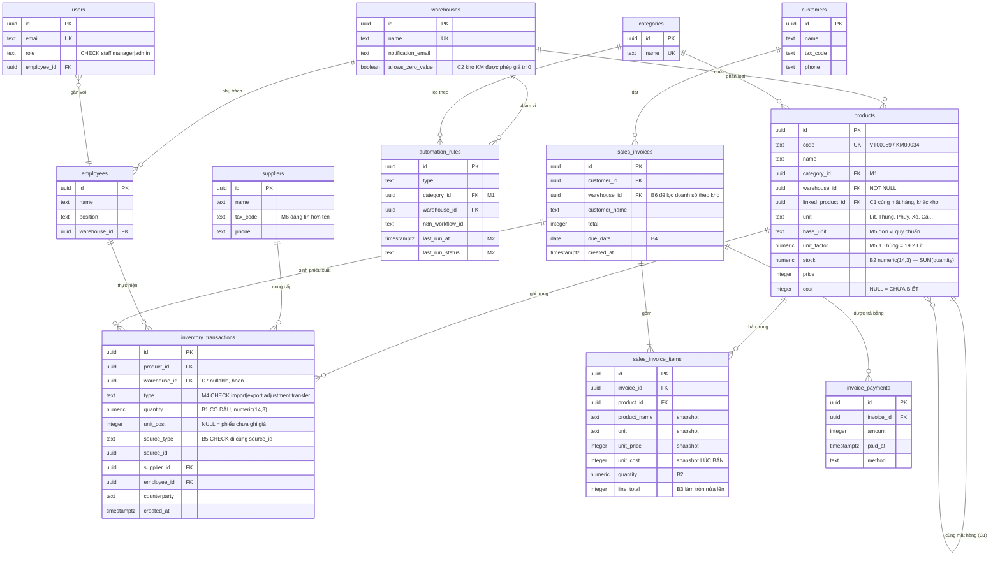

# ERD chuẩn — bản chốt để dựng database

> 10/08/2026 · **Thay thế** ERD v1, ERD v2, ERD v3 và `ERD_Merge_Finalization_Strategy.md`
> Từ đây trở đi chỉ còn một bản. Ba tài liệu kia là lịch sử của quyết định, không phải đặc tả.

Ba câu hỏi mở đã có người trả lời:

| Câu | Trả lời | Ai trả lời |
|---|---|---|
| **M1** — `categories` thành bảng | Duyệt | đội Body |
| **M3** — `KHO KHUYẾN MẠI` là gì | **Chỉ là cách ghi sổ**, không phải kho vật lý. Pilot chạy một kho. | chủ DN |
| **B1** — `quantity` có dấu | Có dấu | đội Body |

Toàn bộ M1–M6 và B1–B7 đã chốt. Lược đồ ở mục 4 dựng được ngay.

---

## 1. Dữ liệu THẬT đã chạy qua — và nó đổi hai quyết định

Sau khi bản trước gửi đi, hai file MISA thật của Hoàng Phát đã được chạy qua bộ
nạp và bộ soi. Không còn suy đoán.

```
Tong_hop_ton_kho-Hoàng-Phát-Kho-HH-24-07.xlsx   119 dòng   đọc 119/119, không cảnh báo
Tong_hop_ton_kho-Hoàng-Phát-Kho-KM-24-07.xlsx    38 dòng   đọc  38/38,  không cảnh báo
```

### 1.1. Bảy điều dữ liệu thật xác nhận hoặc bác bỏ

| # | Phát hiện | Ảnh hưởng |
|---|---|---|
| 1 | **24/157 dòng (15%) có số lượng lẻ**, kể cả `101.48` | `integer` làm hỏng 15% số dòng. **M5/B2 không còn là lập luận** |
| 2 | **10 đơn vị tính** ở kho hàng hoá: Lít (89), kg (12), Xô (7), Chiếc (3), Thùng (2), Chai (2), Phuy, Can, Tuýp, Lon. Kho KM thêm Cái, Bộ | `unit_factor` phải tổng quát, không chỉ thể tích. **M5 đúng** |
| 3 | **Mã hàng hai kho không bao giờ trùng** — `VT*` và `KM*` | `products.warehouse_id NOT NULL` khớp thực tế. **D7 hoãn được** |
| 4 | **2 mặt hàng nằm ở CẢ HAI kho dưới hai mã khác nhau** | → quyết định mới: `linked_product_id` |
| 5 | **29/38 dòng kho KM bị gắn cờ "có số lượng nhưng không ghi giá trị"** | → quyết định mới: `allows_zero_value` |
| 6 | **Hai lỗi tồn âm THẬT** trong sổ khách | bộ soi chạy đúng trên dữ liệu thật |
| 7 | Bố cục header đúng "kiểu A" (nhóm ở dòng 8, cột con ở dòng 9, ô gộp) | bộ nạp không phải sửa gì |

### 1.2. Hai lỗi tồn âm — đã kiểm tay từ ô gốc

Đọc thẳng ô trong file, không qua code:

| Mã | Tên | ĐK | Nhập | Xuất | Cuối kỳ | Tiền |
|---|---|---|---|---|---|---|
| `VT00059` | Dầu ĐC Diesel CI4/SL 15W40 (200L) | 87 | 4.400 | 4.508 | **−21 Lít** | **−1.218.356đ** |
| `KM00034` | Dầu nhớt xe ga SL JASO MB 20W-40 (0.8L×24).KM | 0 | 38,4 | 153,6 | **−115,2 Lít** | 0 |

Tự tính lại độc lập: `87 + 4400 − 4508 = −21` ✓ khớp đúng số MISA in ra.
Giá trị: `5.016.459 + 254.755.000 − 260.989.815 = −1.218.356` ✓ khớp.

**MISA tự tính ra số âm và tự in ra.** Không phải bộ nạp đọc sai.

`KM00034` có bằng chứng sắc hơn: tên hàng ghi `(0.8L×24)` → 1 thùng = 19,2 lít.
Nhập `38,4` = **đúng 2 thùng**. Xuất `153,6` = **đúng 8 thùng**. Thiếu `115,2` =
**đúng 6 thùng**. Số tròn tuyệt đối, nên không phải sai số làm tròn.

> **Chưa kết luận nguyên nhân.** Tồn âm cuối kỳ có hai cách giải thích, và bản
> xuất tổng hợp không phân biệt được:
> 1. thiếu phiếu nhập chưa vào sổ
> 2. phiếu nhập đã có nhưng ghi ngày **sau 24/07** (cắt kỳ)
>
> Cả hai đều đáng kiểm; không cái nào nên để nguyên. Đây cũng là ví dụ sống cho
> `unit_factor`: `1 Thùng = 19,2 Lít`.

---

## 2. Chốt cuối cùng — bảng quyết định

| # | Quyết định | Nguồn |
|---|---|---|
| **M1** | `categories` thành bảng; `automation_rules.category_id` FK | đội Body duyệt |
| **M2** | Bỏ `Workflow`/`WorkflowExecution`; thêm `last_run_at/status/note` vào `automation_rules` | Brain đề xuất |
| **M3** | Giữ **hai dòng `warehouses`** (khớp bản xuất MISA) + cờ `allows_zero_value`. Giao diện pilot chỉ hiện một kho. | chủ DN + dữ liệu thật |
| **M4** | Ép `type` bằng `CHECK`, không phải native enum | ERD team |
| **M5** | `numeric(14,3)`; `unit` + `base_unit` + `unit_factor` một tầng | ERD team, dữ liệu xác nhận |
| **M6** | `suppliers` thành bảng, thêm `tax_code` | ERD team |
| **B1** | `quantity` **có dấu**: `+` tăng kho, `−` giảm kho | đội Body duyệt |
| **B2** | `products.stock` cũng `numeric(14,3)` | 15% dòng có số lẻ |
| **B3** | Làm tròn tiền **nửa lên**, một hàm dùng chung | Brain tính lại để đối chiếu |
| **B4** | Sổ `invoice_payments`; còn nợ suy ra, không lưu | tránh lặp lỗi số dư |
| **B5** | `CHECK` cho cặp `source_type`/`source_id` | FK đa hình |
| **B6** | Hợp đồng máy kiểm được giữa Brain và Body | Brain đang sai 4/8 định danh |
| **B7** | Migration kế tiếp `0012`; giữ ba cột giá vốn | `0011` đã bị chiếm |
| **C1** | `products.linked_product_id` — nối mã KM với mã VT cùng mặt hàng | dữ liệu thật |
| **C2** | `warehouses.allows_zero_value` — kho KM được phép giá trị 0 | 29/38 dòng bị báo oan |
| **D7** | **Hoãn.** `inventory_transactions.warehouse_id` để nullable, chưa `NOT NULL` | mã hàng không trùng giữa hai kho |

---

## 3. Sơ đồ ERD



---

## 4. `schema.ts` — bản chốt

Đã kiểm biên dịch bằng `tsc` với `drizzle-orm@0.45.2` (bản đang dùng): sạch.

```ts
import { boolean, check, integer, numeric, pgTable, text, timestamp, uuid } from "drizzle-orm/pg-core";
import { sql } from "drizzle-orm";
import type { AnyPgColumn } from "drizzle-orm/pg-core";

export const warehouses = pgTable("warehouses", {
  id: uuid("id").primaryKey().defaultRandom(),
  name: text("name").notNull().unique(),
  notificationEmail: text("notification_email"),
  // C2 — bằng chứng: kho KHUYẾN MẠI trong bản xuất MISA thật có 29/38 dòng
  // "có số lượng, giá trị = 0". Đó là TRẠNG THÁI BÌNH THƯỜNG của kho này (hàng
  // nhà cung cấp tặng kèm), không phải lỗi. Không có cờ này thì bộ soi gắn cờ
  // gần như mọi dòng — và bộ soi kêu ca liên tục thì người dùng tắt nó đi.
  allowsZeroValue: boolean("allows_zero_value").notNull().default(false),
  createdAt: timestamp("created_at", { withTimezone: true }).notNull().defaultNow(),
});

// M1
export const categories = pgTable("categories", {
  id: uuid("id").primaryKey().defaultRandom(),
  name: text("name").notNull().unique(),
  createdAt: timestamp("created_at", { withTimezone: true }).notNull().defaultNow(),
});

// M6
export const suppliers = pgTable("suppliers", {
  id: uuid("id").primaryKey().defaultRandom(),
  name: text("name").notNull(),
  // MST đáng tin hơn tên khi đối chiếu hoá đơn đầu vào: "Cty ABC" / "ABC" /
  // "abc trading" là ba chuỗi khác nhau nhưng cùng một MST.
  taxCode: text("tax_code"),
  phone: text("phone"),
  email: text("email"),
  address: text("address"),
  note: text("note"),
  createdAt: timestamp("created_at", { withTimezone: true }).notNull().defaultNow(),
});

export const employees = pgTable("employees", {
  id: uuid("id").primaryKey().defaultRandom(),
  name: text("name").notNull(),
  position: text("position"),
  phone: text("phone"),
  email: text("email"),
  hireDate: timestamp("hire_date", { withTimezone: true }),
  warehouseId: uuid("warehouse_id").references(() => warehouses.id, { onDelete: "set null" }),
  note: text("note"),
  createdAt: timestamp("created_at", { withTimezone: true }).notNull().defaultNow(),
});

export const users = pgTable("users", {
  id: uuid("id").primaryKey().defaultRandom(),
  firstName: text("first_name").notNull(),
  lastName: text("last_name").notNull(),
  email: text("email").notNull().unique(),
  phone: text("phone"),
  passwordHash: text("password_hash").notNull(),
  role: text("role").notNull().default("staff"),
  employeeId: uuid("employee_id").references(() => employees.id, { onDelete: "set null" }),
  createdAt: timestamp("created_at", { withTimezone: true }).notNull().defaultNow(),
}, (t) => [
  check("users_role_hop_le", sql`${t.role} IN ('staff','manager','admin')`),
]);

export const products = pgTable("products", {
  id: uuid("id").primaryKey().defaultRandom(),
  code: text("code").notNull().unique(),
  name: text("name").notNull(),
  categoryId: uuid("category_id").references(() => categories.id, { onDelete: "set null" }),
  warehouseId: uuid("warehouse_id").notNull().references(() => warehouses.id),
  // C1 — bằng chứng: KM00028 và VT00069 là CÙNG một mặt hàng, hai mã, hai kho
  // (kiểm trên bản xuất thật). Hỏi "còn bao nhiêu dầu này" mà chỉ tra một mã là
  // đếm thiếu. Tự trỏ, nullable — mã hàng hoá thường không trỏ đi đâu.
  linkedProductId: uuid("linked_product_id")
    .references((): AnyPgColumn => products.id, { onDelete: "set null" }),
  unit: text("unit").notNull().default("Cái"),
  // M5 — quy đổi MỘT TẦNG. Bản xuất thật có 10 đơn vị: Lít, kg, Xô, Chiếc,
  // Thùng, Chai, Phuy, Can, Tuýp, Lon. Ví dụ có thật: KM00034 ghi "(0.8L×24)",
  // tức 1 Thùng = 19,2 Lít.
  baseUnit: text("base_unit"),
  unitFactor: numeric("unit_factor", { precision: 14, scale: 4, mode: "number" })
    .notNull().default(1),
  // B2 — `integer` cắt cụt 38.4 thành 38, im lặng. 24/157 dòng trong bản xuất
  // thật có số lẻ (15%), kể cả 101.48.
  // `mode: "number"` BẮT BUỘC: mặc định Drizzle trả numeric về CHUỖI, và
  // "38.4" + 12 ra "38.412".
  stock: numeric("stock", { precision: 14, scale: 3, mode: "number" }).notNull().default(0),
  price: integer("price").notNull().default(0),
  // NULL = CHƯA BIẾT, khác hẳn 0 = "hàng không tốn đồng nào". Thiếu phân biệt
  // này thì báo cáo coi mọi mặt hàng chưa nhập giá vốn là lãi 100%.
  cost: integer("cost"),
  createdAt: timestamp("created_at", { withTimezone: true }).notNull().defaultNow(),
  updatedAt: timestamp("updated_at", { withTimezone: true }).notNull().defaultNow(),
}, (t) => [
  check("products_unit_factor_duong", sql`${t.unitFactor} > 0`),
  // Tự trỏ vào chính mình là một vòng lặp vô nghĩa.
  check("products_khong_tu_tro", sql`${t.linkedProductId} IS NULL OR ${t.linkedProductId} <> ${t.id}`),
]);

export const inventoryTransactions = pgTable("inventory_transactions", {
  id: uuid("id").primaryKey().defaultRandom(),
  productId: uuid("product_id").notNull()
    .references(() => products.id, { onDelete: "cascade" }),
  // D7 HOÃN — để nullable. Mã hàng không trùng giữa hai kho (VT* vs KM*) nên
  // suy được từ `products.warehouse_id`. Có sẵn cột thì ngày cần chuyển kho chỉ
  // phải điền, không phải thêm cột rồi truy ngược.
  warehouseId: uuid("warehouse_id").references(() => warehouses.id),
  type: text("type").notNull(),
  // B1 — CÓ DẤU. `+` tăng kho, `−` giảm kho.
  //   stock = SUM(quantity)  -> đối chiếu là MỘT câu truy vấn (phụ lục B.1),
  //   không còn logic cộng-trừ để chép sai ở mỗi nơi cần đối chiếu.
  //   `adjustment` biểu diễn được cả thừa lẫn thiếu mà không cần hai loại.
  //   `transfer` = hai dòng cùng `source_id`: −50 kho nguồn, +50 kho đích.
  quantity: numeric("quantity", { precision: 14, scale: 3, mode: "number" }).notNull(),
  // Giá vốn của chính lô này — đáng tin hơn `products.cost` (bình quân trôi theo
  // thời gian). LUÔN là giá vốn, kể cả ở dòng xuất: ghi giá bán vào đây là biến
  // sổ kho thành sổ doanh thu. NULL = phiếu chưa ghi giá.
  unitCost: integer("unit_cost"),
  // D1 — nối phiếu kho về chứng từ gốc. `counterparty` là chữ tự do nên hai
  // khách trùng tên là đối chiếu không ra, và huỷ hoá đơn không tìm được phiếu
  // kho để đảo lại.
  sourceType: text("source_type"),
  sourceId: uuid("source_id"),
  supplierId: uuid("supplier_id").references(() => suppliers.id, { onDelete: "set null" }),
  employeeId: uuid("employee_id").references(() => employees.id, { onDelete: "set null" }),
  counterparty: text("counterparty"),
  note: text("note"),
  createdAt: timestamp("created_at", { withTimezone: true }).notNull().defaultNow(),
}, (t) => [
  // M4 — ép ở tầng DB. Ghi chú trong code không chặn được `"exprt"` viết nhầm,
  // và một giá trị viết nhầm thì không khớp bộ lọc nào, im lặng, mãi mãi.
  check("inv_tx_type_hop_le",
    sql`${t.type} IN ('import','export','adjustment','transfer')`),
  // B5 — FK đa hình không có ràng buộc nào. Tối thiểu ép hai cột đi cùng nhau:
  // `source_id` mồ côi chỉ lộ ra khi ai đó đi truy vết một chênh lệch.
  check("inv_tx_source_di_cung_nhau",
    sql`(${t.sourceType} IS NULL) = (${t.sourceId} IS NULL)`),
  check("inv_tx_source_type_hop_le",
    sql`${t.sourceType} IS NULL OR ${t.sourceType} IN ('sale','purchase','stocktake','transfer','manual')`),
  // Số lượng 0 không ứng với nghiệp vụ nào — chặn để khỏi có dòng rác.
  check("inv_tx_quantity_khac_khong", sql`${t.quantity} <> 0`),
]);

export const customers = pgTable("customers", {
  id: uuid("id").primaryKey().defaultRandom(),
  name: text("name").notNull(),
  phone: text("phone"),
  email: text("email"),
  address: text("address"),
  taxCode: text("tax_code"),
  note: text("note"),
  createdAt: timestamp("created_at", { withTimezone: true }).notNull().defaultNow(),
});

export const salesInvoices = pgTable("sales_invoices", {
  id: uuid("id").primaryKey().defaultRandom(),
  customerId: uuid("customer_id").references(() => customers.id, { onDelete: "set null" }),
  customerName: text("customer_name").notNull(),
  // B6 — Brain nhận `X-Store-Id` (là warehouse) và cần lọc doanh số theo kho.
  // Không có cột này thì báo cáo doanh thu theo kho không dựng được.
  warehouseId: uuid("warehouse_id").references(() => warehouses.id),
  note: text("note"),
  total: integer("total").notNull(),
  // B4 — hạn thanh toán. Còn nợ SUY RA từ invoice_payments, không lưu.
  dueDate: timestamp("due_date", { withTimezone: true }),
  createdAt: timestamp("created_at", { withTimezone: true }).notNull().defaultNow(),
});

export const salesInvoiceItems = pgTable("sales_invoice_items", {
  id: uuid("id").primaryKey().defaultRandom(),
  invoiceId: uuid("invoice_id").notNull()
    .references(() => salesInvoices.id, { onDelete: "cascade" }),
  productId: uuid("product_id").references(() => products.id, { onDelete: "set null" }),
  // Snapshot lúc bán — lịch sử doanh thu phải đúng kể cả khi sản phẩm đổi giá
  // hoặc bị xoá.
  productName: text("product_name").notNull(),
  unit: text("unit").notNull().default("Cái"),
  unitPrice: integer("unit_price").notNull(),
  // Giá vốn LÚC BÁN. Mất cột này thì lãi gộp lấy giá vốn HÔM NAY áp cho hoá đơn
  // QUÝ TRƯỚC. NULL = chưa biết giá vốn lúc bán.
  unitCost: integer("unit_cost"),
  quantity: numeric("quantity", { precision: 14, scale: 3, mode: "number" }).notNull(),
  // B3 — LÀM TRÒN NỬA LÊN (0.5 -> 1), KHÔNG phải kiểu ngân hàng. Brain tính lại
  // tổng hoá đơn để đối chiếu, nên hai bên làm tròn khác nhau là báo động giả
  // trên chính hoá đơn ĐÚNG — và người dùng học được cách bỏ qua cảnh báo.
  // JS: Math.round() khớp với số dương. Số âm khác (Math.round(-2.5) = -2,
  // Brain ra -3) — chốt lại nếu có dòng âm (chiết khấu, trả hàng).
  lineTotal: integer("line_total").notNull(),
}, (t) => [
  check("invoice_item_quantity_khac_khong", sql`${t.quantity} <> 0`),
]);

// B4 — SỔ thanh toán, không phải cột số dư.
//   còn nợ = sales_invoices.total − SUM(invoice_payments.amount)
// `paid_amount` dạng số dư lặp lại đúng vấn đề mà D6 sinh ra để canh: khách trả
// ba lần, ai đó sửa tay một lần, và không còn cách nào biết đúng sai.
export const invoicePayments = pgTable("invoice_payments", {
  id: uuid("id").primaryKey().defaultRandom(),
  invoiceId: uuid("invoice_id").notNull()
    .references(() => salesInvoices.id, { onDelete: "cascade" }),
  amount: integer("amount").notNull(),
  paidAt: timestamp("paid_at", { withTimezone: true }).notNull().defaultNow(),
  method: text("method"),
  note: text("note"),
}, (t) => [
  check("payment_method_hop_le",
    sql`${t.method} IS NULL OR ${t.method} IN ('cash','bank_transfer','other')`),
  check("payment_amount_khac_khong", sql`${t.amount} <> 0`),
]);

export const companySettings = pgTable("company_settings", {
  id: uuid("id").primaryKey().defaultRandom(),
  name: text("name").notNull().default("ANSER"),
  address: text("address"),
  phone: text("phone"),
  email: text("email"),
  taxCode: text("tax_code"),
  currency: text("currency").notNull().default("VND"),
  updatedAt: timestamp("updated_at", { withTimezone: true }).notNull().defaultNow(),
});

export const automationRules = pgTable("automation_rules", {
  id: uuid("id").primaryKey().defaultRandom(),
  name: text("name").notNull(),
  type: text("type").notNull().default("low_stock_alert"),
  thresholdQty: numeric("threshold_qty", { precision: 14, scale: 3, mode: "number" }),
  // M1 — thay `categoryFilter: text`. Đổi tên danh mục thì luật im lặng ngừng
  // khớp: không lỗi, không cảnh báo, chỉ là không bao giờ chạy nữa.
  categoryId: uuid("category_id").references(() => categories.id, { onDelete: "set null" }),
  warehouseId: uuid("warehouse_id").references(() => warehouses.id, { onDelete: "set null" }),
  enabled: boolean("enabled").notNull().default(true),
  n8nWorkflowId: text("n8n_workflow_id"),
  // M2 — đủ để dashboard hiện "cào giá dầu: hỏng 2 ngày rồi". Workflow cào giá
  // dầu thiết kế để THROW khi bóc giá không được (không ghi giá bịa) — nó hỏng
  // ầm ĩ trong n8n mà không ai bên ANSER nhìn thấy, và sáng hôm sau báo giá vẫn
  // chạy bằng giá của hôm kia. Lịch sử đầy đủ vẫn để n8n giữ.
  lastRunAt: timestamp("last_run_at", { withTimezone: true }),
  lastRunStatus: text("last_run_status"),
  lastRunNote: text("last_run_note"),
  createdAt: timestamp("created_at", { withTimezone: true }).notNull().defaultNow(),
}, (t) => [
  check("automation_last_run_status_hop_le",
    sql`${t.lastRunStatus} IS NULL OR ${t.lastRunStatus} IN ('ok','failed')`),
]);
```

---

## 5. Phụ lục A — chỉ mục

```sql
CREATE INDEX idx_inv_tx_product_date  ON inventory_transactions (product_id, created_at DESC);
CREATE INDEX idx_inv_tx_source        ON inventory_transactions (source_type, source_id);
CREATE INDEX idx_inv_tx_warehouse     ON inventory_transactions (warehouse_id, created_at DESC);
CREATE INDEX idx_products_warehouse   ON products (warehouse_id);
CREATE INDEX idx_products_linked      ON products (linked_product_id) WHERE linked_product_id IS NOT NULL;
CREATE INDEX idx_invoices_date        ON sales_invoices (created_at DESC);
CREATE INDEX idx_invoices_due         ON sales_invoices (due_date) WHERE due_date IS NOT NULL;
CREATE INDEX idx_invoice_items_prod   ON sales_invoice_items (product_id);
CREATE INDEX idx_payments_invoice     ON invoice_payments (invoice_id);
```

## 6. Phụ lục B — ba câu truy vấn thay cho ba đoạn logic

### B.1. Đối chiếu tồn kho (D6) — sau B1 chỉ còn một câu

```sql
SELECT p.code, p.name,
       p.stock                                 AS ton_dang_ghi,
       COALESCE(SUM(t.quantity), 0)            AS ton_theo_so,
       p.stock - COALESCE(SUM(t.quantity), 0)  AS lech
FROM products p
LEFT JOIN inventory_transactions t ON t.product_id = p.id
GROUP BY p.id, p.code, p.name, p.stock
HAVING p.stock <> COALESCE(SUM(t.quantity), 0);
```

Rỗng = khớp. Đây là toàn bộ `POST /api/inventory/reconcile`.

### B.2. Công nợ quá hạn (B4)

```sql
SELECT i.id, i.customer_name, i.total,
       COALESCE(SUM(p.amount), 0)             AS da_tra,
       i.total - COALESCE(SUM(p.amount), 0)   AS con_no,
       CURRENT_DATE - i.due_date::date        AS so_ngay_qua_han
FROM sales_invoices i
LEFT JOIN invoice_payments p ON p.invoice_id = i.id
WHERE i.due_date IS NOT NULL
GROUP BY i.id
HAVING i.total - COALESCE(SUM(p.amount), 0) > 0
   AND i.due_date::date < CURRENT_DATE
ORDER BY i.due_date;
```

Thay hẳn workflow `logistics_debt_reminder` đang chạy trên Google Sheet.

### B.3. Tồn của một mặt hàng, gộp cả mã KM (C1)

```sql
SELECT COALESCE(p.linked_product_id, p.id) AS mat_hang,
       MIN(p.name)                          AS ten,
       SUM(p.stock)                         AS tong_ton,
       string_agg(p.code, ' + ' ORDER BY p.code) AS gom_cac_ma
FROM products p
GROUP BY COALESCE(p.linked_product_id, p.id);
```

Không có `linked_product_id` thì câu này trả `KM00028` và `VT00069` thành hai
mặt hàng khác nhau — và tổng tồn bị chia đôi.

---

## 7. Thứ tự triển khai

| # | Việc | Ai |
|---|---|---|
| 1 | Dán `schema.ts` ở mục 4, chạy `drizzle-kit generate` → `0012_*.sql` | Body |
| 2 | Thêm ràng buộc `CHECK` nếu drizzle-kit bỏ sót (kiểm bằng `\d+` trên Neon) | Body |
| 3 | Sửa `store/sales.ts`: `stock - quantity` → `stock + quantity` với **số âm**; ghi `source_type='sale'` + `source_id=invoice.id` | Body |
| 4 | `POST /api/inventory/reconcile` — dùng câu B.1 | Body |
| 5 | Nhập hai file MISA thật vào; đánh dấu kho KM `allows_zero_value = true`; nối 2 cặp mã qua `linked_product_id` | Body |
| 6 | Brain sửa khối `SCHEMA MAP` theo tên cột đã chốt + thêm bài kiểm đọc thẳng `schema.ts` | Brain |
| 7 | Bộ soi đọc `allows_zero_value` để thôi báo oan 29 dòng kho KM | Brain |

Bước 6 và 7 phụ thuộc bước 1 — bên Brain cố ý **chưa sửa** để khỏi sửa hai lần.

> **Lưu ý bước 3:** đây là thay đổi hành vi, không chỉ thay đổi lược đồ. Sửa
> ngay lúc chưa có dữ liệu là gần như miễn phí; sửa sau khi có vài nghìn phiếu
> thì phải đảo dấu toàn bộ lịch sử.

---

## 8. Hai việc còn mở, không chặn bước nào

1. **Nguyên nhân hai lỗi tồn âm** — thiếu phiếu nhập, hay cắt kỳ? Cần chủ DN
   tra sổ. Bên em **chưa báo khách** cho tới khi loại trừ được khả năng cắt kỳ.
2. **Phần vận tải** (nhà xe, tuyến, chuyến, báo giá, phụ phí) vẫn ở Google
   Sheets. Đưa vào Postgres hay không là câu hỏi kiến trúc, để ERD v4.

---

*Bản này thay thế mọi bản ERD trước. Có chỗ nào chưa hợp lý thì bác trước khi
chạy `drizzle-kit generate` — sau bước đó thì sửa tốn hơn nhiều.*
