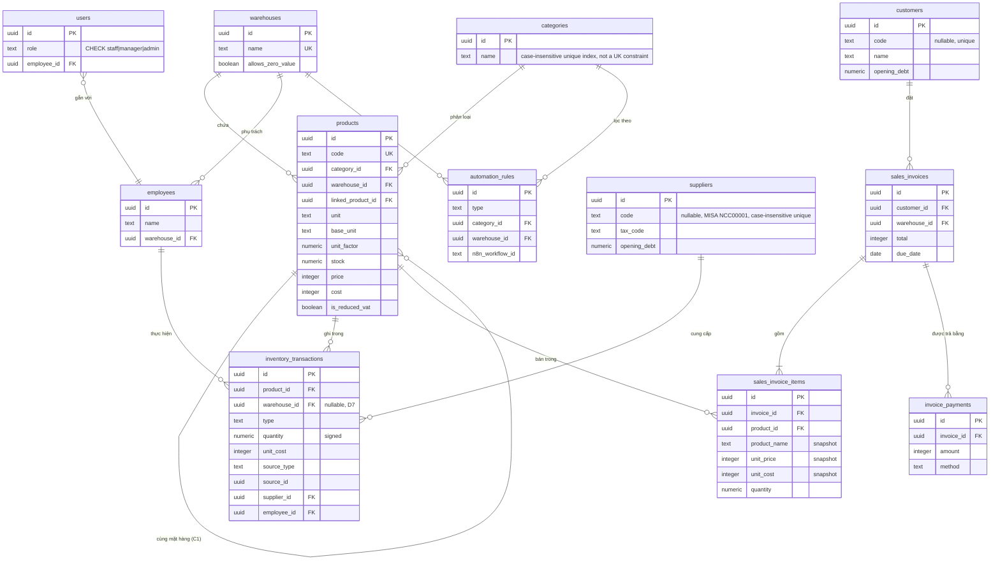

# ANSER-v2 — Project Playbook

> Last updated 17/09/2026
> This doc does not replace documents numbered `0.`–`4.` below — it points at them, tells you which parts are stale, and adds what happened after `4.` was last written.

## 0. How to use this document

Read this first, then go to the specific doc a section points you to. Don't re-read
`0.`–`3.` front-to-back — they're **decision history** (each one superseded by the next,
per their own headers). `schema.ts` is the only thing that's always current; if this
playbook and `schema.ts` disagree, trust `schema.ts` and fix this doc.

## 1. What this project is

**ANSER Web v2** — inventory + sales management for **Hoàng Phát**, a Vietnamese
lubricant/oil distributor. Rewrite of an older Flask codebase (unrelated, not called
into). Single Next.js app: UI + API routes in one project, no separate backend.

| Layer | Choice | Why (see `STACK_DECISIONS.md`) |
|---|---|---|
| Web app | Next.js (App Router, Route Handlers) | One deploy, one type system FE↔BE, no CORS |
| DB | Neon Postgres via Drizzle ORM, `neon-serverless` pool driver | Pool driver (not `neon-http`) specifically because `db.transaction()` is required for inventory writes |
| Auth | JWT in httpOnly cookie | — |
| AI (OCR, chat, audits) | Separate service(s), called over HTTP — see §7 | Keeps the web app from carrying model-serving weight |
| Automation | n8n, self-hosted, called via webhook | — |

## 2. Documentation map

| Doc | Branch | What's in it | Status |
|---|---|---|---|
| `0. HA_TANG_VA_ERD.md` | both | Original infra + ERD v3, proposals D1–D7 | History |
| `1. ERD_Merge_Finalization_Strategy.md` | both | My merge proposal, M1–M6 | History |
| `2. ERD_PHAN_HOI_VA_LUOC_DO.md` | both | Dev team's reply, added B1–B7 | History |
| `3. ERD_CHUAN.md` | both | **Canonical ERD** after real MISA data was run through it. Added C1/C2. Includes full target `schema.ts`, indexes, reconciliation SQL. | **Partially stale** — see §3.1 |
| `4. Database_Implementation_Documentation.md` | **master only** | Step-by-step implementation log for ERD_CHUAN's Task 1–4 (schema migration, constraint verification, `sales.ts` sign-convention fix, `/api/inventory/reconcile`), plus a short retrospective timeline for Task 5, added 18/09. | Not merged into `feat/database-application` — read it on `master` |
| `all_constrain.json`, `single_table_data_types_and_columns.json` | **master only** | Raw Neon `pg_constraint`/`information_schema` dumps used to verify Task 2 above | Reference, not living docs |
| `frontend/CLAUDE.md` | this branch, uncommitted | Dense session log: bugs found/fixed, real-data import findings, prioritized open items | Mine everything in §5 comes from here — read it directly for full detail |
| `frontend/ARCHITECTURE.md` | this branch | Full file-by-file map of the Next.js app, request flows, current limitations table | Current, keep using it |
| `src/server/db/schema.ts` | this branch | **Ground truth.** Ahead of ERD_CHUAN — see §3.1 | Always current |

## 3. Current domain model



Full rationale for every column/constraint (why signed `quantity`, why `NULL` ≠ `0` on
`cost`, why `linked_product_id`, etc.) is in `3. ERD_CHUAN.md` §4 — still accurate for
everything it covers. Don't re-derive those decisions; read them.

### 3.1 Where live `schema.ts` has moved past `ERD_CHUAN`

Migration `0014_youthful_red_wolf.sql` added three things ERD_CHUAN doesn't mention:

| Column | Why (inferred from schema.ts comments) |
|---|---|
| `suppliers.code`, `customers.code` (nullable, case-insensitive unique index) | Reconciliation key against MISA exports — MST/tax code alone isn't reliable (comments cite 42/43 suppliers have one, but only 77/105 customers do) |
| `suppliers.opening_debt`, `customers.opening_debt` (`numeric(18,2)`) | Opening payable/receivable at export time. **This is new schema surface that didn't exist when `frontend/import-real-data.ts` (untracked, see §5) was written** — that script's own comments say no such column exists. It's now wrong on that point. |
| `products.is_reduced_vat` (nullable boolean) | Nghị định 174/2025 2% VAT reduction flag, read by `/api/ai/vat-catalog`. Nullable = "not checked yet," same NULL-≠-false discipline as `cost`. |

Also new since ERD_CHUAN: an **AI module** (`/api/ai/*` — chat, report, freight-invoice
OCR, inventory-audit, inventory-cost, partner-audit, period-diff, vat-catalog) and an
**Excel category-import feature** (`src/server/import/`, latest commit). Neither changed
the core schema beyond the `0014` columns above.

## 4. How we got here (condensed)

1. Two hand-drawn ERDs + `HA_TANG_VA_ERD.md` (v3, D1–D7) needed reconciling against live
   `schema.ts` → I wrote `1. ERD_Merge_Finalization_Strategy.md` (M1–M6).
2. Dev team agreed, added B1–B7 (most importantly **B1**: signed `quantity` instead of
   type+unsigned add/subtract logic) → `2. ERD_PHAN_HOI_VA_LUOC_DO.md`.
3. Real MISA exports run through a loader surfaced two more decisions (C1
   `linked_product_id`, C2 `allows_zero_value`) and confirmed M3 (KHO KHUYẾN MẠI is a
   bookkeeping label — pilot is single-warehouse in practice) → `3. ERD_CHUAN.md`,
   **the canonical schema**, with a 7-step implementation order at its end.
4. `4. Database_Implementation_Documentation.md` (master only) executed that order,
   step by step, with real code diffs:
   - **Task 1** — pasted `schema.ts`, generated `0012_misty_cammi.sql`, diffed
     generated SQL against the source by hand (drizzle-kit has been known to drop
     `check()` constraints), created a Neon `dev` branch off `production` for safe
     experimentation.
   - **Task 2** — verified every constraint actually landed on Neon via
     `pg_constraint`/`information_schema` queries (dumps saved as the two `.json`
     files, master only).
   - **Task 3** — fixed `store/sales.ts`'s sign convention (`stock - quantity` →
     signed `+`), added missing `employeeId` threading, `sourceType`/`sourceId`
     linking a stock movement back to its invoice, `salesInvoices.warehouseId`
     population, proper error-flow in the route handler, and a `.for("update")` row
     lock closing a read-check-write race condition on concurrent sales of the same
     product.
   - **Task 4** — built `GET /api/inventory/reconcile` (compares `products.stock`
     against `SUM(inventory_transactions.quantity)`, `EPSILON = 0.001` for
     numeric(14,3) rounding) — after confirming it doesn't overlap
     `/api/ai/inventory-audit` (external-file diff) or `/api/ai/inventory-cost`
     (one-way cost-sheet write).
   - **Task 5** (real MISA data import, `allows_zero_value` flagging,
     `linked_product_id` linking) — the original plan, sitting in the untracked
     `frontend/import-real-data.ts` (§5 item 1). **Doc updated 18/09 with a
     retrospective instead of a Step 1**: `feat/database-application` branched off
     `master` 23/08 (right after `4.`'s Task 1–4 work merged in), and instead of
     finishing this plan, the team shipped migration `0014` + the new "Nhap Excel"
     catalog-import feature, demoed the app to chú Quyết, then paused the whole
     effort until 18/09. Read literally this sounds like "the general import problem
     got solved, not the specific historical-reconstruction one" — see §5 item 1 for
     why that's evidence, not confirmation.

## 5. Open items (prioritized)

Full detail and reasoning for all of these is in `frontend/CLAUDE.md` — this is the
index, not a replacement.

1. **`frontend/import-real-data.ts` is untracked and stale.** It's the Task 5 script:
   loads the 4 real Hoàng Phát Excel files into Neon. Its own header comments say
   customer/supplier debt "has no schema home" — that's no longer true after `0014`
   added `opening_debt` to both tables (§3.1). Needs a pass before anyone runs it, and
   it should probably start populating `opening_debt` instead of skipping those
   columns.
   **Update 18/09**: the catalog-loading part of this script (products/customers/
   suppliers) is now superseded by the new `src/server/import/` "Nhap Excel" feature
   (`doc-excel.ts` + `ap-dung.ts`) — that feature does it better (correctly populates
   `openingDebt`/`isReducedVat`, has a preview-then-confirm UX). **But that feature
   explicitly, deliberately excludes the `Tổng hợp tồn kho` (N-X-T) report** — its own
   comment says that parsing is left to Brain's `inventory_import.py` on purpose, to
   avoid a second copy of that logic drifting out of sync. Nothing else in this repo
   reconstructs `inventory_transactions` from N-X-T data, links `linked_product_id`
   pairs, or flags `allows_zero_value` — checked 18/09 whether Brain now also *writes*
   that into this app's Postgres DB (not just parses it), and **the team wasn't sure**.
   `4.`'s new Task 5 retrospective (§4) leans the same direction without settling it:
   it frames Task 5 as "addressed by creating a few Import feature" (the catalog
   import above), with no mention of the N-X-T/`linked_product_id`/`allows_zero_value`
   sub-goals — read as the team deciding the *general* import problem was worth
   solving and the *specific* historical-reconstruction one wasn't pursued further,
   which is a different thing from "something else does it." Worth a direct
   confirmation of intent (still wanted, later? or abandoned?) rather than inferring
   either way from a timeline note. **Do not delete this file until that's
   confirmed** — and since it's untracked, deleting it isn't git-reversible; if it
   does get deleted, commit it first so it's at least recoverable from history.
2. **Three products disagree between catalog stock and N-X-T closing balance**
   (`KM00008`, `KM00017`, `KM00034`) — likely genuine untracked activity between the two
   source files' different export dates, not a transcription error. Needs the owner.
3. **Two real negative-stock rows** (`VT00039`, `VT00042` per the corrected count in
   `CLAUDE.md` — ignore the earlier `VT00059` guess in `ERD_CHUAN.md §1.2`, that was
   superseded once real files were checked) — root cause (missing purchase doc vs.
   period cutoff) unconfirmed, **not yet reported to the client** per ERD_CHUAN's own
   note not to until cutoff is ruled out.
4. **No selling price in any source file** — now has an owner explanation (§6) and a
   concrete feature request attached to it. No longer a blind gap.
5. `getSalesReportForPeriod`'s `sum(quantity)::integer` cast truncates fractional
   liters — the one report an n8n workflow actually consumes. Flagged twice, unfixed.
6. Seed-orchestration bug: `seedInitialData()`'s emptiness guard is keyed on
   `products`, so `seedCategories()` silently never runs on a branch that already has
   product rows from before categories existed. Fix agreed (split into independently
   guarded functions under one `runStartupSeed()`), not implemented.
7. `instrumentation.ts` has no environment gate — `seedDemoUser()` runs on every cold
   start including production. Recommended: gate behind an explicit opt-in flag, not
   `NODE_ENV` (some staging/preview environments also report `production`).
8. **Housekeeping**: `git status` on `feat/database-application` currently shows 5
   files as modified that are **pure CRLF/LF line-ending noise** (`instrumentation.ts`,
   migration `0013` + its snapshot, `reports.ts`, `categories.ts` — diffed byte-for-byte,
   zero logical change). Worth a `.gitattributes` before it causes a real merge
   conflict — the Brain team hit the identical problem and it's on their punch list too
   (`BAN_GIAO_VAN_TAI.md`, item 13).

## 6. Current initiative: multi-tier pricing ("Giá áp dụng")

### Business context (meeting with Mr. Quyết)

- Price is **deliberately absent** from every Excel export — it varies per customer
  ("khách ruột" vs "khách lạ") and by multiple factors, not an oversight.
- A fixed/base price list exists, but **changes require approval from someone above**
  before taking effect — not a plain field edit.
- He sets the *daily* price by weighing **Đại lý cấp 1, cấp 2, and giá bán lẻ together**
  against the market — the tiers inform each other, they aren't independent lists set
  once and forgotten.
- Purchase-side cost also tiers: **giá nhập lẻ vs giá nhập sỉ** (retail vs wholesale
  buy price) — a separate concept from the sales-side tiers below.
- His other company's ERP (`erp.eteksofts.com`) only supports **one price-tier field
  per invoice** — mixed-tier invoices must be split into multiple invoices. Anything we
  build should support tier selection **per line item** to beat that limitation.
- Open, unresolved, not a DB question but worth tracking: RBAC on the AI chatbot (who
  gets access, leak risk on his messages) and a TODO for expiry dates / hàng thanh lý
  (clearance stock) — neither has a schema home yet.

### Feature request (from his demo)

A "Giá áp dụng" selector when creating a sales transaction, five tiers:
`Bán lẻ` · `Đại lý cấp 1` · `Đại lý cấp 2` · `Đại lý cấp 3` · `Giá bán thương mại điện tử (online)`.

### Clarified 18/09/2026 (second coworker present at a follow-up pass on the meeting notes)

Two things that change the design, straight from re-checking the meeting notes with
someone else who was in the room:

- **Chú Quyết wears two hats.** He's an *employee* at "Tân Phát" (owner of the
  `erp.eteksofts.com` demo software) and separately the *owner* of "Hoàng Phát" (the
  actual pilot client). The "cần có bên đứng trên để duyệt giá" answer describes **Tân
  Phát's** process (he has to submit for a superior's approval there) — **it does not
  apply to Hoàng Phát**. At Hoàng Phát he's the owner of a 3–5 person team; the
  accountant enters prices by hand and he **monitors**, but there's no one "above him" to
  gate a change. → **Open question #2 below is resolved: no approval workflow to design.**
- **Đại lý cấp 3 and the online/TMĐT price are Tân Phát demo artifacts, not confirmed
  Hoàng Phát tiers.** Tân Phát's software may simply offer a wider price list than
  Hoàng Phát actually uses today. The only tiers confirmed live at Hoàng Phát right now
  are **Bán lẻ, Đại lý cấp 1, Đại lý cấp 2**. Cấp 3/online might get added later — and
  when they do, it needs to be a data insert, not a schema migration. **This rules out a
  hardcoded `CHECK ... IN (5 values)` enum** (my first sketch) in favor of a lookup table.

### Proposed schema — **open proposal, not yet implemented, needs sign-off**

```ts
// Lookup table, not a hardcoded enum — adding a tier later (cấp 3, online, or
// anything else Hoàng Phát comes up with) is an INSERT, not a migration.
export const priceTiers = pgTable("price_tiers", {
  id: uuid("id").primaryKey().defaultRandom(),
  code: text("code").notNull(), // 'retail' | 'agent_1' | 'agent_2' | ... — free-form
  name: text("name").notNull(), // display label, e.g. "Bán lẻ"
  sortOrder: integer("sort_order").notNull().default(0),
  active: boolean("active").notNull().default(true), // retire a tier without deleting its price history
  createdAt: timestamp("created_at", { withTimezone: true }).notNull().defaultNow(),
}, (t) => [
  uniqueIndex("price_tiers_code_unique").on(sql`lower(${t.code})`),
]);

export const productPrices = pgTable("product_prices", {
  id: uuid("id").primaryKey().defaultRandom(),
  productId: uuid("product_id").notNull().references(() => products.id, { onDelete: "cascade" }),
  tierId: uuid("tier_id").notNull().references(() => priceTiers.id, { onDelete: "restrict" }),
  price: integer("price").notNull(),
  updatedAt: timestamp("updated_at", { withTimezone: true }).notNull().defaultNow(),
}, (t) => [
  uniqueIndex("product_prices_product_tier_unique").on(t.productId, t.tierId),
]);
```

Seed only the 3 confirmed rows (`retail`/`agent_1`/`agent_2`) — do not pre-seed
`agent_3`/`online` until Hoàng Phát actually asks for them.

Plus one nullable FK on the existing sale line (nullable = walk-in/manual override,
no tier picked):

```ts
priceTierId: uuid("price_tier_id").references(() => priceTiers.id, { onDelete: "set null" }), // on sales_invoice_items
```

**Open questions to resolve before writing the migration**:

1. **`products.price` is read directly in a lot of places today**
   (`reports.ts`'s `totalStockValue`, `sales.ts` defaulting `unitPrice`, the products
   list UI). Does it become the `retail` row's mirror, get dropped in favor of always
   joining `product_prices`, or stay as a fallback when a tier price isn't set? Pick
   one before migrating — this determines whether it's an additive migration or a
   breaking one.
2. ~~Approval workflow~~ **Resolved 18/09** — no approval gate needed for Hoàng Phát (see
   above). Still worth asking whether "chú giám sát" wants more than that — e.g. a plain
   `updated_by`/`updated_at` on `product_prices` for visibility, short of a blocking
   workflow. Low priority, not a blocker.
3. **Effective-dating** — prices are "sửa liên tục." Is last-write-wins acceptable, or
   does reporting need to know what a tier's price *was* on a past date independent of
   any sale (the sale-line snapshot only captures the price actually charged, not the
   tier's list price history)?
4. **Purchase-side tiers** (giá nhập lẻ/sỉ) — separate table mirroring this one against
   `inventory_transactions`, or out of scope until sales-side ships first? Still open —
   also still unconfirmed whether this was a direct answer to a specific question or a
   volunteered aside (see the meeting note's own 18/09 follow-up list).
5. **Confirmed still open, not resolved by the 18/09 pass**: does the AI team's
   long-term-vs-walk-in idea (§7) end up as another row in `price_tiers`, a
   `customers.default_tier_id` column, or something orthogonal to this table entirely
   (e.g. a discount applied *within* whatever tier a customer is already on)? Directly
   confirmed as genuinely undecided — not something chú Quyết clarified, not something
   the AI team has written down yet either.

## 7. Dependency: the AI/"Brain" team

Separate repo: `PCBoiz/ANSER_AI`, branch `feat/workflow-format-and-deterministic-core`.
Two handover docs exist there (`TIEN_TRINH_BRAIN.md` — accounting/AI engine status,
`BAN_GIAO_VAN_TAI.md` — transport/freight quoting module, deprioritized to a side
branch because the pilot customer isn't a transport company). Neither doc currently
specifies the long-term-vs-walk-in customer pricing idea in writing — as of this
writing it's still a conversation on their side, not a spec.

**One principle from their docs is worth carrying into any pricing work here**: their
non-negotiable rule is that AI **never computes financial numbers, only deterministic
code does** (they had a real incident where a model mentally computed
`5.000.000 + 500.000`, got it right, and that was flagged as dangerous precisely
*because* it happened to be correct that one time). Whatever the AI team proposes for
customer-tier pricing, the actual charged-price calculation belongs in this repo's
deterministic backend — Brain can recommend or explain a tier, it shouldn't be the
thing computing the number that ends up on an invoice.

## 8. Working in this repo — operational notes

- **One lockfile**: `frontend/pnpm-lock.yaml`. Any package manager to develop with, but
  `pnpm install` + commit the lockfile after any dependency change (`README.md`).
- **Drizzle workflow**: edit `schema.ts` → `pnpm db:generate` → **manually diff the
  generated SQL against `schema.ts`** before trusting it — drizzle-kit has dropped
  `check()` constraints before (see §4, Task 1 step 2) → `pnpm db:migrate`.
- **Verify constraints actually landed** on Neon after migrating, don't just trust the
  generator — the `pg_constraint`/`information_schema` queries in `4.` (master) are the
  pattern to reuse.
- **Use a Neon branch for experiments** (`dev`, parented off `production`), not
  production directly — this project already does this (§4, Task 1 step 3).
- **Line endings**: see §5 item 8 before you touch any of the 5 currently-noisy files —
  check your editor's line-ending setting first, or you'll add a 6th.

## 9. Suggested next steps for whoever picks this up

1. Read `frontend/CLAUDE.md` in full (this playbook only indexes it).
2. Decide the `products.price` vs `product_prices` question in §6 before writing any
   migration for the pricing feature — it's the one decision that changes the shape of
   the migration.
3. Resolve or re-run `frontend/import-real-data.ts` against the current schema (§5.1)
   before treating any dev-branch data as trustworthy.
4. Get the two negative-stock rows and the three-product mismatch (§5.2/5.3) in front
   of the owner — both are explicitly flagged as "don't report yet" pending that.
5. Add a `.gitattributes` (line-ending normalization) — cheap, and the Brain team
   already proved it's worth doing.
