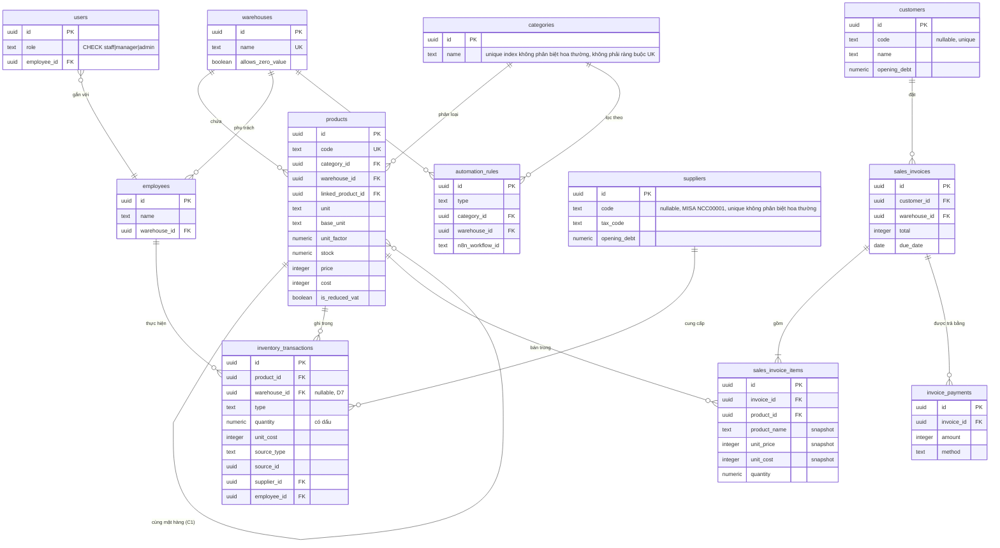

# ANSER-v2 — Sổ Tay Dự Án

> Bản dịch tiếng Việt của `5. Project_Playbook.md`.
> Cập nhật lần cuối 18/09/2026.
> Tài liệu này không thay thế các tài liệu đánh số `0.`–`4.` bên dưới — nó chỉ trỏ tới từng tài liệu, cho biết phần nào đã cũ, và bổ sung những gì xảy ra sau khi `4.` được viết lần cuối. 
> Nếu bản này và bản tiếng Anh lệch nhau sau khi chỉnh sửa, coi bản tiếng Anh là gốc.

## 0. Cách dùng tài liệu này

Đọc phần này trước, rồi đi tới đúng tài liệu mà từng mục trỏ tới. Đừng đọc lại toàn bộ
`0.`–`3.` từ đầu đến cuối — đó là **lịch sử quyết định** (mỗi bản bị bản sau thay thế, theo
đúng lời mở đầu của từng tài liệu). `schema.ts` là thứ duy nhất luôn đúng nhất; nếu sổ tay
này và `schema.ts` mâu thuẫn nhau, tin `schema.ts` và sửa lại tài liệu này.

## 1. Dự án này là gì

**ANSER Web v2** — hệ thống quản lý kho + bán hàng cho **Hoàng Phát**, doanh nghiệp phân
phối dầu nhớt tại Việt Nam. Viết lại từ một codebase Flask cũ (không liên quan, không gọi
vào code cũ). Một app Next.js duy nhất: UI + API route trong cùng 1 project, không tách
backend riêng.

| Tầng | Lựa chọn | Vì sao (xem `STACK_DECISIONS.md`) |
|---|---|---|
| Web app | Next.js (App Router, Route Handlers) | Một lần deploy, một hệ kiểu dữ liệu dùng chung FE↔BE, không cần CORS |
| DB | Neon Postgres qua Drizzle ORM, driver pool `neon-serverless` | Dùng driver pool (không phải `neon-http`) vì `db.transaction()` là bắt buộc cho các thao tác ghi kho |
| Auth | JWT lưu trong cookie httpOnly | — |
| AI (OCR, chat, kiểm toán) | (Các) service riêng, gọi qua HTTP — xem §7 | Giữ cho web app không phải gánh tải model AI |
| Tự động hoá | n8n, tự host, gọi qua webhook | — |

## 2. Bản đồ tài liệu

| Tài liệu | Nhánh | Nội dung | Trạng thái |
|---|---|---|---|
| `0. HA_TANG_VA_ERD.md` | cả hai | Hạ tầng gốc + ERD v3, đề xuất D1–D7 | Lịch sử |
| `1. ERD_Merge_Finalization_Strategy.md` | cả hai | Đề xuất gộp của tôi, M1–M6 | Lịch sử |
| `2. ERD_PHAN_HOI_VA_LUOC_DO.md` | cả hai | Phản hồi của đội dev, thêm B1–B7 | Lịch sử |
| `3. ERD_CHUAN.md` | cả hai | **ERD chuẩn** sau khi chạy dữ liệu MISA thật qua bộ nạp. Thêm C1/C2. Có kèm `schema.ts` mục tiêu đầy đủ, index, SQL đối chiếu. | **Đã cũ một phần** — xem §3.1 |
| `4. Database_Implementation_Documentation.md` | **chỉ có ở master** | Nhật ký triển khai từng bước cho Task 1–4 của ERD_CHUAN (migrate schema, kiểm tra constraint, sửa quy ước dấu trong `sales.ts`, `/api/inventory/reconcile`), kèm một đoạn nhìn lại ngắn cho Task 5, thêm ngày 18/09. | Chưa merge vào `feat/database-application` — đọc trên `master` |
| `all_constrain.json`, `single_table_data_types_and_columns.json` | **chỉ có ở master** | Dữ liệu thô từ Neon (`pg_constraint`/`information_schema`) dùng để kiểm tra Task 2 ở trên | Tài liệu tham chiếu, không phải tài liệu sống |
| `frontend/CLAUDE.md` | nhánh này, chưa commit | Nhật ký phiên làm việc chi tiết: bug đã tìm/đã sửa, phát hiện khi nhập dữ liệu thật, danh sách việc còn mở theo thứ tự ưu tiên | Mọi thứ ở §5 đều lấy từ đây — đọc trực tiếp để biết chi tiết đầy đủ |
| `frontend/ARCHITECTURE.md` | nhánh này | Bản đồ đầy đủ từng file của app Next.js, luồng request, bảng hạn chế hiện tại | Còn hiện hành, tiếp tục dùng |
| `src/server/db/schema.ts` | nhánh này | **Nguồn chuẩn xác nhất.** Đã vượt qua ERD_CHUAN — xem §3.1 | Luôn cập nhật |

## 3. Mô hình dữ liệu hiện tại



Toàn bộ lý do cho từng cột/ràng buộc (vì sao `quantity` có dấu, vì sao `NULL` khác `0` ở
`cost`, vì sao có `linked_product_id`, v.v.) nằm trong `3. ERD_CHUAN.md` §4 — vẫn đúng cho
mọi thứ nó đề cập. Đừng suy luận lại các quyết định đó; đọc trực tiếp.

### 3.1 Những chỗ `schema.ts` thực tế đã vượt qua `ERD_CHUAN`

Migration `0014_youthful_red_wolf.sql` thêm 3 thứ mà ERD_CHUAN không nhắc tới:

| Cột | Vì sao (suy ra từ comment trong schema.ts) |
|---|---|
| `suppliers.code`, `customers.code` (nullable, unique index không phân biệt hoa thường) | Khoá đối chiếu với bản xuất MISA — chỉ dùng MST thì không đáng tin (comment ghi 42/43 nhà cung cấp có MST, nhưng chỉ 77/105 khách hàng có) |
| `suppliers.opening_debt`, `customers.opening_debt` (`numeric(18,2)`) | Công nợ đầu kỳ tại thời điểm xuất file. **Đây là phần schema mới, chưa tồn tại lúc `frontend/import-real-data.ts` (chưa track, xem §5) được viết** — comment của chính script đó nói không có cột này. Giờ điều đó không còn đúng nữa. |
| `products.is_reduced_vat` (boolean, nullable) | Cờ giảm 2% thuế GTGT theo Nghị định 174/2025, được đọc bởi `/api/ai/vat-catalog`. Nullable = "chưa kiểm tra", cùng nguyên tắc NULL-khác-false như `cost`. |

Cũng mới so với ERD_CHUAN: một **module AI** (`/api/ai/*` — chat, report, OCR hoá đơn nhà
xe, inventory-audit, inventory-cost, partner-audit, period-diff, vat-catalog) và một
**tính năng nhập danh mục từ Excel** (`src/server/import/`, commit gần nhất). Cả hai đều
không đổi phần lõi của schema ngoài các cột `0014` ở trên.

## 4. Quá trình đi đến đây (rút gọn)

1. Hai bản ERD vẽ tay + `HA_TANG_VA_ERD.md` (v3, D1–D7) cần được đối chiếu với `schema.ts`
   thực tế → tôi viết `1. ERD_Merge_Finalization_Strategy.md` (M1–M6).
2. Đội dev đồng ý, thêm B1–B7 (quan trọng nhất là **B1**: `quantity` có dấu thay vì logic
   cộng/trừ theo loại giao dịch không dấu) → `2. ERD_PHAN_HOI_VA_LUOC_DO.md`.
3. Chạy dữ liệu MISA thật qua bộ nạp, phát sinh thêm 2 quyết định (C1 `linked_product_id`,
   C2 `allows_zero_value`) và xác nhận M3 (KHO KHUYẾN MẠI chỉ là nhãn ghi sổ — thực tế pilot
   chạy một kho) → `3. ERD_CHUAN.md`, **schema chuẩn**, kèm thứ tự triển khai 7 bước ở cuối.
4. `4. Database_Implementation_Documentation.md` (chỉ có ở master) thực hiện đúng thứ tự
   đó, từng bước, kèm diff code thật:
   - **Task 1** — dán `schema.ts`, sinh `0012_misty_cammi.sql`, tự tay diff SQL sinh ra với
     source (drizzle-kit từng bị biết là bỏ sót `check()` constraint), tạo nhánh Neon `dev`
     tách từ `production` để thử nghiệm an toàn.
   - **Task 2** — xác minh từng constraint thực sự có trên Neon qua truy vấn
     `pg_constraint`/`information_schema` (kết quả lưu thành 2 file `.json`, chỉ có ở master).
   - **Task 3** — sửa quy ước dấu trong `store/sales.ts` (`stock - quantity` → cộng một số
     **âm**), bổ sung `employeeId` còn thiếu, nối `sourceType`/`sourceId` từ phiếu kho về hoá
     đơn gốc, điền `salesInvoices.warehouseId`, làm luồng lỗi trong route handler cho đúng, và
     khoá dòng bằng `.for("update")` để chặn race condition đọc-kiểm tra-ghi khi bán cùng 1
     sản phẩm đồng thời.
   - **Task 4** — dựng `GET /api/inventory/reconcile` (so `products.stock` với
     `SUM(inventory_transactions.quantity)`, `EPSILON = 0.001` cho sai số làm tròn
     numeric(14,3)) — sau khi xác nhận nó không trùng chức năng với `/api/ai/inventory-audit`
     (đối chiếu file ngoài) hay `/api/ai/inventory-cost` (ghi một chiều từ bảng giá vốn).
   - **Task 5** (nhập dữ liệu MISA thật, gắn cờ `allows_zero_value`, nối `linked_product_id`)
     — kế hoạch gốc, đang nằm trong `frontend/import-real-data.ts` (chưa track, §5 mục 1).
     **Tài liệu được cập nhật 18/09 bằng một đoạn nhìn lại thay vì viết tiếp Bước 1**:
     `feat/database-application` tách từ `master` ngày 23/08 (ngay sau khi Task 1–4 của
     `4.` được merge vào), và thay vì làm xong kế hoạch này, đội chuyển hướng sang triển
     khai migration `0014` + tính năng "Nhập Excel" mới cho danh mục, demo app cho chú
     Quyết, rồi tạm dừng toàn bộ việc này cho tới 18/09. Đọc theo nghĩa đen thì giống
     "bài toán nhập liệu chung đã được giải, chứ không phải bài toán dựng lại lịch sử
     riêng" — xem §5 mục 1 để biết vì sao đây là bằng chứng, chứ chưa phải xác nhận.

## 5. Việc còn tồn đọng (theo thứ tự ưu tiên)

Chi tiết đầy đủ và lý do cho tất cả các mục dưới đây nằm trong `frontend/CLAUDE.md` — đây
chỉ là mục lục, không thay thế được nó.

1. **`frontend/import-real-data.ts` chưa được track và đã lỗi thời.** Đây là script cho
   Task 5: nạp 4 file Excel thật của Hoàng Phát vào Neon. Comment đầu file của nó nói công
   nợ khách hàng/nhà cung cấp "chưa có chỗ trong schema" — điều này không còn đúng từ khi
   `0014` thêm `opening_debt` vào cả 2 bảng (§3.1). Cần rà lại trước khi ai đó chạy nó, và có
   lẽ nên bắt đầu điền `opening_debt` thay vì bỏ qua các cột đó.
   **Cập nhật 18/09**: phần nhập danh mục (products/customers/suppliers) của script này
   giờ đã được thay thế bởi tính năng "Nhập Excel" mới trong `src/server/import/`
   (`doc-excel.ts` + `ap-dung.ts`) — tính năng đó làm tốt hơn (điền đúng `openingDebt`/
   `isReducedVat`, có màn hình xem trước rồi mới xác nhận ghi). **Nhưng tính năng đó cố ý
   bỏ qua hẳn báo cáo `Tổng hợp tồn kho` (N-X-T)** — comment của chính nó nói việc đọc file
   đó được để dành cho `inventory_import.py` bên Brain, tránh dựng một bản sao thứ hai của
   logic đó rồi để hai bên trôi xa nhau. Không có chỗ nào khác trong repo này dựng lại
   `inventory_transactions` từ dữ liệu N-X-T, nối cặp `linked_product_id`, hay gắn cờ
   `allows_zero_value` — đã hỏi ngày 18/09 xem Brain có ghi luôn dữ liệu đó vào Postgres của
   app này không (chứ không chỉ đọc file), và **đội chưa chắc, cần hỏi lại**. Đoạn nhìn lại
   Task 5 mới thêm trong `4.` (§4) cũng nghiêng về hướng này mà chưa chốt hẳn: tài liệu mô
   tả Task 5 là "đã được giải quyết bằng cách tạo ra vài tính năng Import" (chính là tính
   năng nhập danh mục ở trên), không nhắc gì tới các mục N-X-T/`linked_product_id`/
   `allows_zero_value` — đọc được là đội quyết định bài toán nhập liệu *chung* đáng làm,
   còn bài toán dựng lại lịch sử *riêng* thì không theo tiếp, khác hẳn với "có chỗ khác làm
   việc đó rồi." Đáng để hỏi thẳng ý định (vẫn muốn làm sau này, hay bỏ hẳn?) hơn là suy
   diễn theo hướng nào từ một đoạn ghi timeline. **Đừng xoá file này cho tới khi có câu trả
   lời** — vì file chưa được track, xoá đi sẽ không thể phục hồi
   qua git; nếu sau này quyết định xoá, hãy commit nó trước để ít nhất còn giữ được trong
   lịch sử.
2. **3 sản phẩm lệch giữa tồn kho trong catalog và số dư cuối kỳ trong báo cáo N-X-T**
   (`KM00008`, `KM00017`, `KM00034`) — nhiều khả năng là hoạt động thật chưa được ghi nhận
   giữa hai ngày xuất file khác nhau, không phải lỗi nhập liệu. Cần hỏi chủ doanh nghiệp.
3. **2 dòng tồn kho âm có thật** (`VT00039`, `VT00042` theo số liệu đã sửa lại trong
   `CLAUDE.md` — bỏ qua phỏng đoán `VT00059` trước đó trong `ERD_CHUAN.md §1.2`, đã bị thay
   thế sau khi kiểm tra file thật) — nguyên nhân gốc (thiếu phiếu nhập hay do cắt kỳ) chưa
   xác nhận được, **chưa báo cho khách** theo đúng lưu ý của chính ERD_CHUAN là đừng báo cho
   tới khi loại trừ được khả năng cắt kỳ.
4. **Không có giá bán trong bất kỳ file nguồn nào** — giờ đã có lời giải thích từ chủ doanh
   nghiệp (§6) và một yêu cầu tính năng cụ thể đi kèm. Không còn là một khoảng trống mù mờ.
5. Phép ép kiểu `sum(quantity)::integer` trong `getSalesReportForPeriod` làm mất phần lẻ —
   đúng vào báo cáo duy nhất mà một workflow n8n thực sự dùng tới. Đã gắn cờ 2 lần, chưa sửa.
6. Bug thứ tự seed dữ liệu: điều kiện "bảng rỗng" của `seedInitialData()` chỉ kiểm tra bảng
   `products`, nên `seedCategories()` âm thầm không bao giờ chạy trên một nhánh đã có sẵn sản
   phẩm từ trước khi khái niệm category tồn tại. Đã thống nhất cách sửa (tách thành các hàm
   tự kiểm tra độc lập, gom lại dưới một `runStartupSeed()`), chưa triển khai.
7. `instrumentation.ts` không có cờ chặn theo môi trường — `seedDemoUser()` chạy ở mọi lần
   cold start, kể cả production. Đề xuất: chặn bằng một flag bật riêng, không dùng `NODE_ENV`
   (một số môi trường staging/preview cũng báo là `production`).
8. **Dọn dẹp**: `git status` trên `feat/database-application` hiện đang báo 5 file bị sửa mà
   thực chất chỉ là **nhiễu do đổi line-ending CRLF/LF** (`instrumentation.ts`, migration
   `0013` + snapshot của nó, `reports.ts`, `categories.ts` — diff từng byte, không có thay đổi
   logic nào). Nên thêm `.gitattributes` trước khi nó gây xung đột merge thật — đội Brain
   cũng gặp đúng vấn đề này và đã đưa vào danh sách việc của họ (`BAN_GIAO_VAN_TAI.md`, mục 13).

## 6. Việc đang làm: giá nhiều mức ("Giá áp dụng")

### Bối cảnh nghiệp vụ (họp với chú Quyết)

- Giá bán **cố ý không có** trong mọi file Excel xuất ra — vì giá thay đổi theo từng khách
  hàng ("khách ruột" khác "khách lạ") và theo nhiều yếu tố khác, không phải do sơ suất.
- Có tồn tại một bảng giá cố định/gốc, nhưng **thay đổi cần được người ở trên duyệt** trước
  khi có hiệu lực — không phải sửa trực tiếp một trường dữ liệu.
- Chú quyết định giá *hằng ngày* bằng cách cân nhắc **Đại lý cấp 1, cấp 2, và giá bán lẻ
  cùng lúc** so với thị trường — các mức giá này ảnh hưởng lẫn nhau, không phải là các bảng
  giá độc lập chỉ set một lần rồi bỏ đó.
- Giá nhập (mua vào) cũng có mức: **giá nhập lẻ và giá nhập sỉ** — một khái niệm tách biệt
  với các mức giá bán ở dưới.
- Phần mềm ERP của công ty khác của chú (`erp.eteksofts.com`) chỉ hỗ trợ **1 trường mức giá
  cho mỗi hoá đơn** — hoá đơn có sản phẩm cần bán theo mức giá khác phải tách thành nhiều hoá
  đơn. Bất cứ thứ gì ANSER xây nên hỗ trợ chọn mức giá **theo từng dòng sản phẩm** để vượt
  qua hạn chế này.
- Còn mở, chưa giải quyết, không phải câu hỏi về DB nhưng đáng theo dõi: RBAC cho chatbot AI
  (ai được dùng, rủi ro rò rỉ tin nhắn của chú) và TODO về hạn sử dụng / hàng thanh lý — cả
  hai đều chưa có chỗ trong schema.

### Yêu cầu tính năng (từ buổi demo của chú)

Một bộ chọn "Giá áp dụng" khi tạo giao dịch bán hàng, 5 mức:
`Bán lẻ` · `Đại lý cấp 1` · `Đại lý cấp 2` · `Đại lý cấp 3` · `Giá bán thương mại điện tử (online)`.

### Làm rõ ngày 18/09/2026 (có đồng nghiệp thứ hai cùng rà lại ghi chú buổi họp)

Hai điều sau làm thay đổi thiết kế, rút ra trực tiếp từ việc rà lại ghi chú buổi họp cùng
người khác cũng có mặt hôm đó:

- **Chú Quyết mang hai vai trò.** Chú là *nhân viên* ở "Tân Phát" (chủ sở hữu phần mềm demo
  `erp.eteksofts.com`) và đồng thời là *chủ sở hữu* của "Hoàng Phát" (khách hàng pilot thật
  sự). Câu trả lời "cần có bên đứng trên để duyệt giá" mô tả quy trình của **Tân Phát** (ở đó
  chú phải trình lên cấp trên duyệt) — **không áp dụng cho Hoàng Phát**. Ở Hoàng Phát chú là
  chủ của một đội 3–5 người; kế toán nhập giá tay và chú **giám sát**, nhưng không có ai "ở
  trên chú" để chặn một thay đổi. → **Câu hỏi mở #2 bên dưới coi như đã giải quyết: không cần
  thiết kế quy trình duyệt.**
- **Đại lý cấp 3 và giá online/TMĐT là chi tiết từ demo của Tân Phát, chưa được xác nhận là
  mức giá của Hoàng Phát.** Phần mềm của Tân Phát có thể đơn giản là có bảng giá rộng hơn
  những gì Hoàng Phát thực tế đang dùng. Các mức giá được xác nhận đang dùng thật ở Hoàng
  Phát hiện chỉ có **Bán lẻ, Đại lý cấp 1, Đại lý cấp 2**. Cấp 3/online có thể được thêm sau
  — và khi đó, việc thêm phải là một thao tác INSERT dữ liệu, không phải một migration
  schema. **Điều này loại bỏ phương án `CHECK ... IN (5 giá trị)` cứng** (bản phác thảo đầu
  tiên của tôi) để chuyển sang dùng bảng tra cứu (lookup table).

### Đề xuất schema — **đề xuất mở, chưa triển khai, cần được thông qua**

```ts
// Bảng tra cứu (lookup table), không phải enum cứng — thêm một mức giá mới sau này
// (cấp 3, online, hay bất cứ gì Hoàng Phát nghĩ ra) là một câu INSERT, không phải migration.
export const priceTiers = pgTable("price_tiers", {
  id: uuid("id").primaryKey().defaultRandom(),
  code: text("code").notNull(), // 'retail' | 'agent_1' | 'agent_2' | ... — tự do, không ép cứng
  name: text("name").notNull(), // tên hiển thị, vd "Bán lẻ"
  sortOrder: integer("sort_order").notNull().default(0),
  active: boolean("active").notNull().default(true), // ngừng dùng một mức giá mà không xoá lịch sử giá của nó
  createdAt: timestamp("created_at", { withTimezone: true }).notNull().defaultNow(),
}, (t) => [
  uniqueIndex("price_tiers_code_unique").on(sql`lower(${t.code})`),
]);

export const productPrices = pgTable("product_prices", {
  id: uuid("id").primaryKey().defaultRandom(),
  productId: uuid("product_id").notNull().references(() => products.id, { onDelete: "cascade" }),
  tierId: uuid("tier_id").notNull().references(() => priceTiers.id, { onDelete: "restrict" }),
  price: integer("price").notNull(),
  updatedAt: timestamp("updated_at", { withTimezone: true }).notNull().defaultNow(),
}, (t) => [
  uniqueIndex("product_prices_product_tier_unique").on(t.productId, t.tierId),
]);
```

Chỉ seed 3 dòng đã xác nhận (`retail`/`agent_1`/`agent_2`) — đừng seed sẵn `agent_3`/`online`
cho tới khi Hoàng Phát thực sự yêu cầu.

Thêm một cột FK nullable trên dòng bán hàng hiện có (nullable = khách vãng lai/ghi đè tay,
không chọn mức giá nào):

```ts
priceTierId: uuid("price_tier_id").references(() => priceTiers.id, { onDelete: "set null" }), // trên sales_invoice_items
```

**Câu hỏi mở cần giải quyết trước khi viết migration**:

1. **`products.price` hiện đang được đọc trực tiếp ở rất nhiều chỗ**
   (`totalStockValue` trong `reports.ts`, `unitPrice` mặc định trong `sales.ts`, giao diện
   danh sách sản phẩm). Nó sẽ trở thành bản sao của dòng `retail`, bị bỏ hẳn để luôn join
   với `product_prices`, hay giữ lại làm giá trị dự phòng khi một mức giá chưa được set? Cần
   chốt trước khi migrate — quyết định này quyết định migration là additive hay breaking.
2. ~~Quy trình duyệt giá~~ **Đã giải quyết 18/09** — không cần cổng duyệt cho Hoàng Phát (xem
   ở trên). Vẫn đáng hỏi thêm liệu "chú giám sát" có muốn nhiều hơn thế không — vd một cặp
   `updated_by`/`updated_at` đơn giản trên `product_prices` để có thể xem lại, chứ không cần
   một quy trình chặn thật sự. Ưu tiên thấp, không phải điểm chặn.
3. **Hiệu lực theo thời gian (effective-dating)** — giá "sửa liên tục". Ghi đè trực tiếp
   (last-write-wins) có chấp nhận được không, hay báo cáo cần biết giá của một mức tại một
   thời điểm trong quá khứ, độc lập với bất kỳ giao dịch bán nào (snapshot trên dòng hoá đơn
   chỉ ghi lại giá đã bán thực tế, không phải lịch sử giá niêm yết của cả mức giá đó)?
4. **Mức giá bên mua** (giá nhập lẻ/sỉ) — làm một bảng riêng tương tự bảng này nhưng gắn với
   `inventory_transactions`, hay để ngoài phạm vi cho tới khi bên bán xong trước? Vẫn còn mở
   — cũng chưa xác nhận được đây là câu trả lời trực tiếp cho một câu hỏi cụ thể hay là chú
   tự nói thêm (xem danh sách câu hỏi còn treo ngày 18/09 trong chính ghi chú buổi họp).
5. **Xác nhận vẫn còn mở, chưa được giải quyết ở đợt rà soát 18/09**: ý tưởng khách lâu năm
   so với khách vãng lai của đội AI (§7) rốt cuộc sẽ là thêm một dòng trong `price_tiers`,
   một cột `customers.default_tier_id`, hay một thứ hoàn toàn tách biệt khỏi bảng này (vd một
   khoản giảm giá áp *trong* mức giá mà khách đã thuộc về)? Đã xác nhận trực tiếp là vẫn chưa
   ai quyết được — không phải điều chú Quyết đã làm rõ, và đội AI cũng chưa viết thành văn
   bản.

## 7. Phụ thuộc: đội AI/"Brain"

Repo riêng: `PCBoiz/ANSER_AI`, nhánh `feat/workflow-format-and-deterministic-core`. Có 2 tài
liệu bàn giao ở đó (`TIEN_TRINH_BRAIN.md` — tình trạng engine kế toán/AI,
`BAN_GIAO_VAN_TAI.md` — module báo giá vận tải, đã bị hạ ưu tiên sang nhánh phụ vì khách
pilot không phải công ty vận tải). Không tài liệu nào trong 2 cái đó hiện có ghi rõ ý tưởng
giá theo khách lâu năm-vs-vãng lai bằng văn bản — tính đến lúc viết bài này, nó vẫn chỉ là
một cuộc trao đổi miệng phía họ, chưa thành spec.

**Một nguyên tắc từ tài liệu của họ đáng mang theo vào bất kỳ việc gì liên quan tới giá ở
đây**: nguyên tắc không thương lượng của họ là AI **không bao giờ tính ra số liệu tài chính,
chỉ có code tất định mới được làm việc đó** (họ từng gặp một sự cố thật: một model tự nhẩm
`5.000.000 + 500.000` trong đầu, ra đúng kết quả, và điều đó bị đánh dấu là nguy hiểm chính
*vì* nó tình cờ đúng lần đó). Dù đội AI đề xuất gì cho việc định giá theo khách hàng, phép
tính giá thật sự tính vào hoá đơn nên nằm ở backend tất định của repo này — Brain có thể gợi
ý hoặc giải thích một mức giá, chứ không nên là nơi tính ra con số cuối cùng ghi vào hoá đơn.

## 8. Làm việc trong repo này — lưu ý vận hành

- **Một lockfile duy nhất**: `frontend/pnpm-lock.yaml`. Dùng package manager nào tuỳ ý để
  phát triển, nhưng phải `pnpm install` + commit lại lockfile sau mỗi lần đổi dependency
  (`README.md`).
- **Quy trình Drizzle**: sửa `schema.ts` → `pnpm db:generate` → **tự tay diff SQL sinh ra với
  `schema.ts`** trước khi tin nó — drizzle-kit từng bỏ sót `check()` constraint (xem §4, Task
  1 bước 2) → `pnpm db:migrate`.
- **Xác minh constraint thực sự có trên Neon** sau khi migrate, đừng chỉ tin bộ sinh migration
  — các truy vấn `pg_constraint`/`information_schema` trong `4.` (master) là khuôn mẫu để
  dùng lại.
- **Dùng nhánh Neon riêng để thử nghiệm** (`dev`, tách từ `production`), đừng thử trực tiếp
  trên production — dự án này đã làm vậy rồi (§4, Task 1 bước 3).
- **Line ending**: xem mục 8 ở §5 trước khi đụng vào 1 trong 5 file đang bị nhiễu — kiểm tra
  cấu hình line-ending của editor trước, kẻo bạn lại thêm file thứ 6.

## 9. Đề xuất việc cần làm tiếp theo

1. Đọc toàn bộ `frontend/CLAUDE.md` (sổ tay này chỉ lập mục lục cho nó).
2. Chốt câu hỏi `products.price` so với `product_prices` ở §6 trước khi viết migration nào
   cho tính năng giá — đây là quyết định duy nhất làm thay đổi hình dạng của migration.
3. Rà lại hoặc chạy lại `frontend/import-real-data.ts` cho khớp với schema hiện tại (§5.1)
   trước khi coi bất kỳ dữ liệu nào trên nhánh dev là đáng tin.
4. Đưa 2 dòng tồn kho âm và 3 sản phẩm lệch số liệu (§5.2/§5.3) ra trước mặt chủ doanh nghiệp
   — cả hai đều được đánh dấu rõ là "chưa báo vội" cho tới lúc đó.
5. Thêm `.gitattributes` (chuẩn hoá line-ending) — rẻ, và đội Brain đã chứng minh là đáng
   làm.
