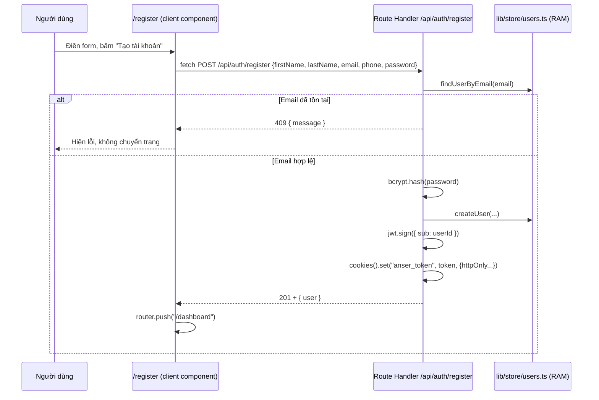
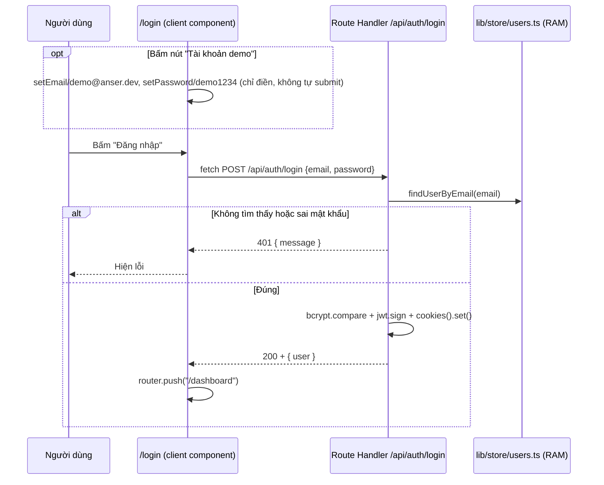

# ANSER Web v2 — Kiến trúc & Luồng hoạt động

Tài liệu này giải thích cấu trúc project, vai trò từng file, và các luồng dữ liệu chính
(đăng ký, đăng nhập, truy cập dashboard). Viết cho người mới join hoặc AI agent đọc để
nắm nhanh hiện trạng code mà không cần đọc lại toàn bộ lịch sử commit.

## 1. Tổng quan

**1 project Next.js duy nhất** (`frontend/`) — vừa là UI vừa là backend:

- UI: các trang trong `src/app/` (App Router).
- Backend: **Route Handlers** (`src/app/api/**/route.ts`) — chạy trên Node.js runtime,
  cùng process với UI, cùng origin (`http://localhost:3000`).
- Không còn CORS, không còn `credentials: "include"` — frontend gọi thẳng `fetch("/api/...")`.
- Xác thực dùng JWT lưu trong cookie `httpOnly` (không phải token trả về JS đọc được).
- Dữ liệu user hiện **lưu tạm trong RAM** (mất khi restart dev server) — chưa nối database
  thật (dự kiến Neon Postgres).
- Thiết kế UI (màu tối, quả cầu neon, layout auth 2 cột, dashboard sidebar/topbar/KPI)
  lấy cảm hứng từ 2 app Flask cũ `ANSER_gateway` và `ANSER_san-xuat`, nhưng code là viết
  mới hoàn toàn, không copy/gọi vào code của 2 app đó.

> **Lịch sử**: project này *từng* tách thành 2 (`frontend` Next.js + `backend` Express),
> giao tiếp qua REST API chéo-origin. Đã gộp lại thành 1 Next.js fullstack để đơn giản hóa
> deploy và bỏ hoàn toàn phần phức tạp CORS/cookie chéo-origin. `backend/` đã bị xoá khỏi
> repo (còn trong lịch sử git nếu cần tham khảo).

> **Lưu ý quan trọng khi deploy lên Vercel**: Route Handlers chạy dưới dạng serverless
> function — mỗi request có thể rơi vào instance khác nhau, nên **user lưu trong RAM sẽ
> không đồng bộ/mất ngay cả khi server "chưa restart"** theo nghĩa thông thường. Nếu tự
> host Next.js dạng 1 process bền (VPS/Docker, `next start`) thì RAM store vẫn hoạt động
> ổn định như hiện tại. → Việc nối Neon Postgres nên làm trước khi deploy thật.

## 2. Cấu trúc thư mục đầy đủ

```
ANSER-web-v2/
└── frontend/
    ├── .env.local                 # biến môi trường thật (không commit)
    ├── .env.local.example
    ├── .gitignore
    ├── next.config.ts
    ├── postcss.config.mjs
    ├── eslint.config.mjs
    ├── package.json
    ├── tsconfig.json
    └── src/
        ├── app/
        │   ├── layout.tsx         # root layout (font, <html>/<body>, metadata)
        │   ├── globals.css        # import Tailwind + theme vars + keyframes
        │   ├── page.tsx           # route "/"          — landing page
        │   ├── login/page.tsx     # route "/login"     — form đăng nhập
        │   ├── register/page.tsx  # route "/register"  — form đăng ký
        │   ├── dashboard/
        │   │   ├── layout.tsx     # route "/dashboard/*" — khung sidebar+topbar
        │   │   └── page.tsx       # route "/dashboard"   — nội dung dashboard (mock data)
        │   └── api/
        │       ├── health/route.ts          # GET  /api/health
        │       └── auth/
        │           ├── register/route.ts    # POST /api/auth/register
        │           ├── login/route.ts       # POST /api/auth/login
        │           └── logout/route.ts      # POST /api/auth/logout
        ├── lib/
        │   ├── auth.ts            # JWT_SECRET, ký token, cấu hình cookie
        │   └── store/
        │       └── users.ts       # "database" tạm trong RAM
        └── components/
            ├── AmbientOrbs.tsx        # nền quả cầu neon trôi nổi
            ├── AuthShell.tsx          # khung 2 cột dùng chung login/register
            ├── FloatingInput.tsx      # input với floating label
            └── dashboard/
                ├── Sidebar.tsx
                ├── Topbar.tsx
                ├── StatCard.tsx
                ├── BarChartCard.tsx
                └── icons.tsx          # icon SVG viết tay
```

## 3. File cấu hình gốc

| File | Vai trò |
|---|---|
| `package.json` | Script `dev`/`build`/`start`/`lint`. Deps: `next`, `react`, `react-dom`, `bcryptjs`, `jsonwebtoken`. |
| `next.config.ts` | Cấu hình Next.js — hiện **để trống**, chưa custom gì. |
| `postcss.config.mjs` | Khai báo plugin `@tailwindcss/postcss` (cách Tailwind v4 hook vào build CSS). |
| `eslint.config.mjs` | Flat config ESLint, kế thừa preset `eslint-config-next` (core-web-vitals + typescript). |
| `.env.local` / `.env.local.example` | Biến `JWT_SECRET` — khoá ký JWT. Không còn `NEXT_PUBLIC_API_URL` (không cần nữa vì cùng origin). |
| `tsconfig.json` | Alias `@/*` → `./src/*`. |

> **Breaking change cần biết**: bản Next.js này (16.2.12) đã **đổi tên `middleware.ts`
> thành `proxy.ts`** (hàm export cũng đổi từ `middleware` thành `proxy`). Nếu sau này thêm
> route-protection, phải dùng convention mới — xem
> `node_modules/next/dist/docs/01-app/03-api-reference/03-file-conventions/proxy.md`.

## 4. Backend — Route Handlers & lib

| File | Vai trò |
|---|---|
| `src/lib/auth.ts` | `JWT_SECRET` (đọc từ env, có fallback dev), `COOKIE_NAME = "anser_token"`, `signToken()`, `authCookieOptions` (httpOnly, sameSite lax, maxAge 7 ngày **tính bằng giây** — khác Express `res.cookie` dùng ms). |
| `src/lib/store/users.ts` | `Map<email, User>` lưu trong RAM. Export `findUserByEmail`, `createUser`, `toPublicUser` (ẩn `passwordHash`), `DEMO_ACCOUNT`, `seedDemoUser()` — được gọi ngay khi module này được import lần đầu (thay cho việc gọi ở entrypoint như Express trước đây). |
| `src/app/api/health/route.ts` | `GET` → `{ status: "ok" }`. |
| `src/app/api/auth/register/route.ts` | `POST` — đọc `request.json()`, validate, hash mật khẩu (`bcryptjs`), `createUser`, ký JWT, `cookies().set()`, trả `{ user }`. |
| `src/app/api/auth/login/route.ts` | `POST` — tìm user, `bcrypt.compare`, ký JWT, set cookie, trả `{ user }`. |
| `src/app/api/auth/logout/route.ts` | `POST` — `cookies().delete()`, trả `204`. |

### Endpoint chi tiết

| Method & Path | Input (JSON body) | Thành công | Lỗi |
|---|---|---|---|
| `POST /api/auth/register` | `firstName, lastName, email, phone?, password` | `201` + set cookie + `{ user }` | `400` thiếu field/mật khẩu <6 ký tự, `409` email đã tồn tại |
| `POST /api/auth/login` | `email, password` | `200` + set cookie + `{ user }` | `400` thiếu field, `401` sai email/mật khẩu |
| `POST /api/auth/logout` | — | `204`, xoá cookie | — |
| `GET /api/health` | — | `200 { status: "ok" }` | — |

**Vì sao dùng `cookies()` từ `next/headers` thay vì set header thủ công?** Route Handlers
trong Next.js hỗ trợ đọc/ghi cookie trực tiếp qua `await cookies()` — không cần tự dựng
`Set-Cookie` header hay dùng thư viện như `cookie-parser` (khác Express).

## 5. Frontend — UI

### `src/app/` — routing (App Router: 1 thư mục = 1 URL)

| File | Route | Vai trò |
|---|---|---|
| `layout.tsx` | root | Bọc mọi trang: load font Geist, khai báo `metadata`. |
| `globals.css` | — | `@import "tailwindcss"`, biến theme, keyframe `anser-orb-float`. |
| `page.tsx` | `/` | Landing: navbar, hero, bento-grid 4 tính năng, footer CTA. |
| `login/page.tsx` | `/login` | Client component, gọi `fetch("/api/auth/login")` (đường dẫn tương đối, không cần `credentials`), nút demo tự điền form, `router.push("/dashboard")` khi thành công. |
| `register/page.tsx` | `/register` | Tương tự login, gọi `/api/auth/register`. |
| `dashboard/layout.tsx` | `/dashboard/*` | `<Sidebar/>` + `<Topbar/>` + `<main>{children}</main>`. |
| `dashboard/page.tsx` | `/dashboard` | Banner, 4 `StatCard`, 2 `BarChartCard`, 2 widget, bảng sản phẩm, thông báo. **Toàn bộ dữ liệu mock hardcode.** |

### `src/components/`

| File | Vai trò |
|---|---|
| `AmbientOrbs.tsx` | 3 quả cầu mờ blur, animate trôi nổi. |
| `AuthShell.tsx` | Khung 2 cột dùng chung login+register. |
| `FloatingInput.tsx` | `<input>` + `<label>` dùng Tailwind `peer`. |
| `dashboard/Sidebar.tsx` | Menu trái: logo + 6 mục (chỉ "Trang chủ" có link thật). |
| `dashboard/Topbar.tsx` | Tìm kiếm, chuông thông báo, avatar (hardcode "Sơn Dương"). |
| `dashboard/StatCard.tsx` | Thẻ KPI. |
| `dashboard/BarChartCard.tsx` | Biểu đồ cột vẽ bằng CSS. |
| `dashboard/icons.tsx` | Icon SVG viết tay. |

## 6. Các luồng hoạt động chính

### 6.1 Luồng đăng ký



### 6.2 Luồng đăng nhập (kể cả nút "Tài khoản demo")



`demo@anser.dev` / `demo1234` được tạo tự động ngay khi `lib/store/users.ts` được import
lần đầu (dòng `seedDemoUser()` ở cuối file) — không cần đăng ký trước.

### 6.3 Luồng truy cập `/dashboard`

Hiện **chưa có kiểm tra đăng nhập** ở route này — bất kỳ ai gõ URL `/dashboard` đều
vào được, kể cả chưa từng đăng nhập. Vẫn cần triển khai `proxy.ts` (xem mục 3) để
chặn dựa trên sự tồn tại/hợp lệ của cookie `anser_token` trước khi vào route — nhưng
gọn hơn nhiều so với lúc còn 2 project, vì `proxy.ts` chạy cùng process, đọc cookie
trực tiếp, không cần gọi API riêng để xác minh.

## 7. Hạn chế hiện tại / việc cần làm tiếp

| Vấn đề | Rủi ro | Hướng giải quyết |
|---|---|---|
| User lưu trong `Map` (RAM) | Mất dữ liệu khi restart; **mất/không đồng bộ giữa các request nếu deploy serverless (Vercel)** | Nối Neon Postgres — chỉ cần sửa nội bộ `lib/store/users.ts`, giữ nguyên interface các hàm export |
| `JWT_SECRET` có fallback ngầm `"dev-secret-change-me"` | Nếu quên set env ở production, token dễ bị giả mạo | Bắt app crash ngay lúc build/start nếu thiếu `JWT_SECRET` ở production |
| `/dashboard` không chặn truy cập | Ai cũng xem được dashboard mà không cần đăng nhập | Thêm `src/proxy.ts` (không phải `middleware.ts`!) kiểm tra cookie |
| Không rate-limit `/api/auth/login` | Dễ bị brute-force mật khẩu | Thêm rate-limit trong Route Handler hoặc ở `proxy.ts` |
| Validate input thủ công (`if (!x)`) | Lọt dữ liệu sai định dạng (email, phone...) | Dùng `zod` để validate schema request body |
| Không có error handler tập trung | Lỗi runtime không kiểm soát trong Route Handler trả về 500 mặc định của Next, không có format nhất quán | Viết helper `apiError()`/wrapper dùng chung cho mọi route |
| Dashboard toàn dữ liệu mock hardcode | Không phản ánh dữ liệu thật | Xây API sản phẩm/kho/sản xuất thật (thêm route trong `api/`), thay dữ liệu mock bằng `fetch` |
| `Topbar` hardcode tên "Sơn Dương" | Không đúng với user đang đăng nhập | Lấy từ session thật (đọc cookie + verify JWT trong 1 route `/api/auth/me` hoặc trong Server Component) |
