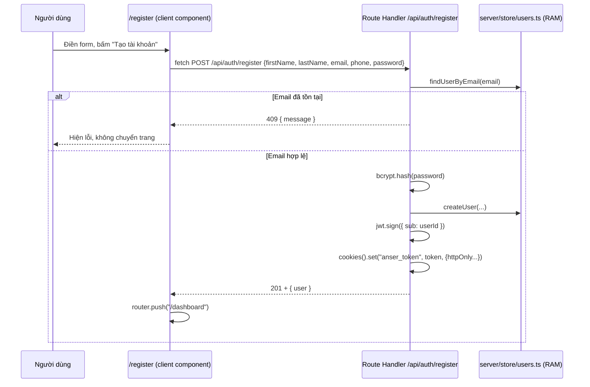
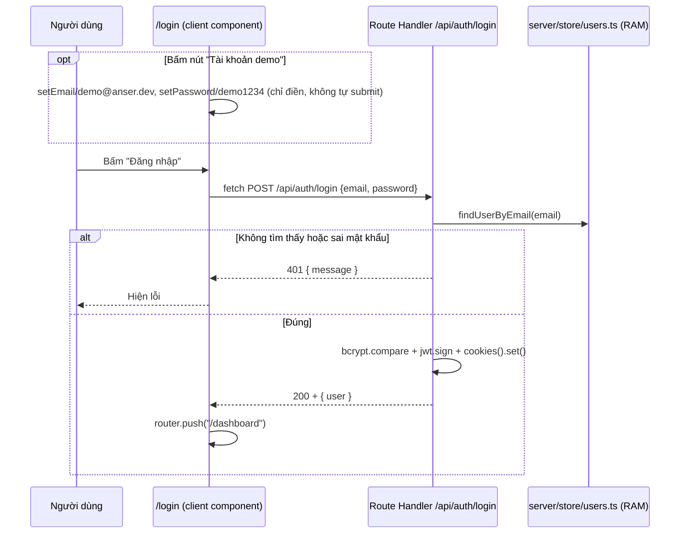

# ANSER Web v2 — Kiến trúc & Luồng hoạt động

Tài liệu này giải thích cấu trúc project, vai trò từng file, và các luồng dữ liệu chính
(đăng ký, đăng nhập, truy cập dashboard). Viết cho người mới join hoặc AI agent đọc để
nắm nhanh hiện trạng code mà không cần đọc lại toàn bộ lịch sử commit.

## 1. Tổng quan

**1 project Next.js duy nhất** (`frontend/`) — vừa là UI vừa là backend:

- UI: các trang trong `src/app/` (App Router).
- Backend: **Route Handlers** (`src/app/api/**/route.ts`) — chạy trên Node.js runtime,
  cùng process với UI, cùng origin (`http://localhost:3000`).
- Không còn CORS, không còn `credentials: "include"` — frontend gọi thẳng `fetch("/api/...")`.
- Xác thực dùng JWT lưu trong cookie `httpOnly` (không phải token trả về JS đọc được).
- Dữ liệu (users, sản phẩm, giao dịch kho, quy tắc tự động hoá) lưu trong **Neon Postgres**,
  truy vấn qua **Drizzle ORM** (`drizzle-orm/neon-serverless`, driver Pool qua WebSocket —
  cần thiết vì driver HTTP nhẹ hơn `neon-http` không hỗ trợ `db.transaction()`, mà việc
  nhập/xuất kho cần transaction để đồng bộ số dòng giao dịch với tồn kho sản phẩm).
- Thiết kế UI (màu tối, quả cầu neon, layout auth 2 cột, dashboard sidebar/topbar/KPI)
  lấy cảm hứng từ 2 app Flask cũ `ANSER_gateway` và `ANSER_san-xuat`, nhưng code là viết
  mới hoàn toàn, không copy/gọi vào code của 2 app đó.
- **Đa kho (multi-warehouse)**: mỗi sản phẩm thuộc đúng 1 kho (`products.warehouseId`).
  Bộ chọn kho multi-select chỉ có ở trang Quản lý kho (state cục bộ, không cookie/Context
  toàn cục) — các trang khác luôn xem gộp toàn bộ kho. Xem mục 4.1.
- **Tự động hoá qua n8n**: 3 workflow (cảnh báo tồn kho thấp, báo cáo doanh số định kỳ, chào
  mừng khách hàng mới) adapt từ ANSER Flask, chạy trong container n8n riêng, gọi vào các
  Route Handler `/api/n8n/internal/*`. Rule đã liên kết Workflow ID thật thì nút Chạy/Dừng/Lịch
  sử ở trang Tự động hoá gọi thẳng n8n Public API (activate/deactivate/executions) — không chỉ
  đổi cờ trong DB của app. Xem mục 4.2.
- **Nhân sự & phân quyền**: hồ sơ nhân viên (`employees`) tách riêng khỏi tài khoản đăng nhập
  (`users`, có `role`: staff/manager/admin). Trang `/dashboard/staff` (chỉ admin) quản lý cả
  hai. Xem mục 4.3.

> **Lịch sử**: project này *từng* tách thành 2 (`frontend` Next.js + `backend` Express),
> giao tiếp qua REST API chéo-origin. Đã gộp lại thành 1 Next.js fullstack để đơn giản hóa
> deploy và bỏ hoàn toàn phần phức tạp CORS/cookie chéo-origin. `backend/` đã bị xoá khỏi
> repo (còn trong lịch sử git nếu cần tham khảo).

> **Lưu ý quan trọng khi deploy lên Vercel**: Route Handlers chạy dưới dạng serverless
> function — mỗi request có thể rơi vào instance khác nhau, nên **user lưu trong RAM sẽ
> không đồng bộ/mất ngay cả khi server "chưa restart"** theo nghĩa thông thường. Nếu tự
> host Next.js dạng 1 process bền (VPS/Docker, `next start`) thì RAM store vẫn hoạt động
> ổn định như hiện tại. → Việc nối Neon Postgres nên làm trước khi deploy thật.

## 2. Cấu trúc thư mục đầy đủ

```
ANSER-web-v2/
└── frontend/
    ├── .env.local                 # biến môi trường thật (không commit)
    ├── .env.local.example
    ├── .gitignore
    ├── next.config.ts
    ├── postcss.config.mjs
    ├── eslint.config.mjs
    ├── package.json
    ├── tsconfig.json
    └── src/
        ├── app/
        │   ├── layout.tsx         # root layout (font, <html>/<body>, metadata)
        │   ├── globals.css        # import Tailwind + theme vars + keyframes
        │   ├── page.tsx           # route "/"          — landing page
        │   ├── login/page.tsx     # route "/login"     — form đăng nhập
        │   ├── register/page.tsx  # route "/register"  — form đăng ký
        │   ├── dashboard/
        │   │   ├── layout.tsx     # route "/dashboard/*" — khung sidebar+topbar
        │   │   └── page.tsx       # route "/dashboard"   — nội dung dashboard (mock data)
        │   └── api/
        │       ├── health/route.ts          # GET  /api/health
        │       └── auth/
        │           ├── register/route.ts    # POST /api/auth/register
        │           ├── login/route.ts       # POST /api/auth/login
        │           └── logout/route.ts      # POST /api/auth/logout
        ├── server/
        │   ├── auth.ts            # JWT_SECRET, ký token, cấu hình cookie
        │   └── store/
        │       └── users.ts       # "database" tạm trong RAM
        └── components/
            ├── AmbientOrbs.tsx        # nền quả cầu neon trôi nổi
            ├── AuthShell.tsx          # khung 2 cột dùng chung login/register
            ├── FloatingInput.tsx      # input với floating label
            └── dashboard/
                ├── Sidebar.tsx
                ├── Topbar.tsx
                ├── StatCard.tsx
                ├── BarChartCard.tsx
                └── icons.tsx          # icon SVG viết tay
```

## 3. File cấu hình gốc

| File | Vai trò |
|---|---|
| `package.json` | Script `dev`/`build`/`start`/`lint`. Deps: `next`, `react`, `react-dom`, `bcryptjs`, `jsonwebtoken`. |
| `next.config.ts` | Cấu hình Next.js — hiện **để trống**, chưa custom gì. |
| `postcss.config.mjs` | Khai báo plugin `@tailwindcss/postcss` (cách Tailwind v4 hook vào build CSS). |
| `eslint.config.mjs` | Flat config ESLint, kế thừa preset `eslint-config-next` (core-web-vitals + typescript). |
| `.env.local` / `.env.local.example` | Biến `JWT_SECRET` — khoá ký JWT. Không còn `NEXT_PUBLIC_API_URL` (không cần nữa vì cùng origin). |
| `tsconfig.json` | Alias `@/*` → `./src/*`. |

> **Breaking change cần biết**: bản Next.js này (16.2.12) đã **đổi tên `middleware.ts`
> thành `proxy.ts`** (hàm export cũng đổi từ `middleware` thành `proxy`). Nếu sau này thêm
> route-protection, phải dùng convention mới — xem
> `node_modules/next/dist/docs/01-app/03-api-reference/03-file-conventions/proxy.md`.

## 4. Backend — Route Handlers & server

### 4.1 Đa kho (multi-warehouse)

- Mỗi sản phẩm thuộc đúng 1 kho (`products.warehouseId`, FK → `warehouses`, `NOT NULL`).
  Kho 1/Kho 2 có SKU độc lập hoàn toàn — không phải 1 danh mục chung chia tồn kho.
  `inventoryTransactions`/`salesInvoices`/`salesInvoiceItems` **không có cột kho riêng** —
  suy ra qua `productId → products.warehouseId`.
- **Lọc theo kho là tính năng riêng của trang Quản lý kho (`/dashboard/inventory`) —
  không phải khái niệm toàn cục.** Không có cookie/Context nào chia sẻ "kho đang chọn"
  giữa các trang. `dashboard/inventory/page.tsx` tự quản lý state `selectedWarehouseIds`
  cục bộ (React state, mặc định = toàn bộ kho ngay khi fetch xong `/api/warehouses`), tự
  render `<WarehouseSwitcher>` (component thuần props: `warehouses`, `selectedIds`,
  `onChange`, `onWarehouseCreated` — không dùng Context), và tự truyền
  `?warehouseIds=id1,id2` (query param tường minh) khi gọi `/api/products` và
  `/api/inventory/transactions`.
- **Mọi trang khác** (Sản phẩm, Bán hàng, Tự động hoá, Báo cáo, Dashboard) **luôn xem gộp
  toàn bộ kho**, không có bộ lọc kho nào cả — `Topbar` không còn nút chọn kho. Các Route
  Handler dùng chung (`/api/products`, `/api/inventory/transactions` GET) chỉ lọc theo kho
  khi có `?warehouseIds=` tường minh trong URL; không có thì trả về tất cả (không đọc
  cookie nào). `/api/sales/invoices`, `/api/automation/rules`, `/api/automation/alerts`,
  `getReportSummary()` **không nhận tham số lọc kho nữa** — luôn tính trên mọi kho hiện có
  (`getReportSummary()` tự gọi `listWarehouses()` bên trong để lấy toàn bộ ID).
- Ràng buộc nghiệp vụ: 1 hoá đơn/phiếu kho không được chứa sản phẩm từ 2 kho khác nhau
  (`CrossWarehouseError` trong `server/store/sales.ts#createInvoice`) — vì sản phẩm chọn ở
  form đã tự quyết định kho, không có field "Kho" riêng trên form Nhập/Xuất kho hay Bán hàng.
  Trang Bán hàng hiện tên kho ngay trong dropdown chọn sản phẩm để tránh nhầm lẫn khi 2 kho
  hiện gộp chung 1 danh sách.
- Backfill lịch sử: `products.warehouseId` được thêm **nullable trước, backfill vào "Kho 1"
  qua `ensureDefaultWarehouseAndBackfill()` (gọi mỗi lần server khởi động, idempotent), rồi
  mới `ALTER COLUMN ... SET NOT NULL`** ở migration sau — vì bảng `products` đã có dữ liệu
  thật lúc thêm cột này.

### 4.2 Tự động hoá & n8n

Adapt từ `d:\ASDEMO\ANSER\workflow_templates\` (app Flask ANSER bán lẻ) — không copy nguyên
JSON vì workflow gốc gọi API nội bộ đặc thù Flask và phụ thuộc tính năng ANSER chưa có ở đây
(subscription, Discord, IoT POS, OCR hoá đơn). Chỉ mang sang **3 workflow khớp tính năng có sẵn**:

| Workflow | Trigger | Gọi vào Next.js |
|---|---|---|
| Cảnh báo tồn kho thấp | Lịch, mỗi 6 giờ | `GET /api/n8n/internal/warehouses` → lặp từng kho → `GET /api/n8n/internal/low-stock?warehouseId=` (tái dùng `evaluateAlerts()` có sẵn) |
| Báo cáo doanh số ngày/tuần/tháng | Lịch (20h mỗi ngày/7 ngày/30 ngày) | `GET /api/n8n/internal/daily-sales?period=day\|week\|month` (dùng `getSalesReportForPeriod()`) + `GET /api/n8n/internal/warehouses` (lấy email nhận) |
| Chào mừng khách hàng mới | Webhook n8n (`POST /webhook/new-customer`) | Next.js **tự gọi** webhook này sau khi `POST /api/customers` tạo khách hàng thành công |

- n8n chạy trong Docker (`frontend/docker-compose.yml`, port `5679`) cùng MailHog (SMTP giả lập
  để xem "email đã gửi" tại `localhost:8026`, không gửi email thật) — mô phỏng
  `d:\ASDEMO\ANSER\docker-compose.yml` nhưng đổi cổng (5679/1026/8026) để không đụng nếu chạy
  song song với n8n của ANSER Flask (5680/1025/8025).
- Chiều Next.js → n8n dùng `triggerN8nWebhook()` (`src/server/n8n.ts`) — **fire-and-forget**, bọc
  try/catch, không throw: n8n tắt/chưa cấu hình không được làm hỏng luồng tạo khách hàng chính.
- `warehouses.notificationEmail` (nullable) — email nhận cảnh báo/báo cáo cho từng kho, sửa
  qua ô nhỏ trong dropdown `WarehouseSwitcher` (trang Quản lý kho), lưu qua
  `PATCH /api/warehouses/{id}`.
- 5 file workflow JSON đã adapt (đổi URL sang API mới, bỏ field không tồn tại như `code` khách
  hàng hay `unique_staff`) nằm ở `frontend/n8n-workflows/`, cùng `README.md` hướng dẫn import
  thủ công qua n8n UI (không tự động hoá qua REST API — đúng cách ANSER Flask cũng làm).

**Điều khiển thật qua n8n Public API** (đối chiếu với `d:\ASDEMO\ANSER\routes\n8n_api.py` — Flask
tự gọi n8n REST API để tạo/tìm workflow, **không** bắt người dùng nhập tay ID gì cả; ở đây làm
theo đúng triết lý đó thay vì thiết kế ban đầu từng yêu cầu dán ID thủ công):

- `automationRules.n8nWorkflowId` (nullable) — vẫn là cột lưu ID, nhưng được **tự động điền**
  lúc bấm nút template trong panel Templates (xem dưới), không cần người dùng gõ tay. Rule chưa
  liên kết (rule tự tạo qua "+ Thêm quy tắc", không qua template) vẫn hoạt động như bookkeeping
  thuần (chỉ đổi cờ `enabled` trong DB app) — có ô "liên kết" thủ công như một fallback nếu cần
  gán tay (vd workflow đã đổi tên trong n8n khiến auto-match theo tên thất bại).
- `src/server/n8nApi.ts` — client gọi n8n Public API (`X-N8N-API-KEY` header, cần tạo API key thủ
  công ở n8n UI Settings → n8n API, cấu hình qua `N8N_API_URL`/`N8N_API_KEY`):
  `listN8nWorkflows()` (GET `/api/v1/workflows`), `createN8nWorkflow()` (POST `/api/v1/
  workflows`), `activateN8nWorkflow()`/`deactivateN8nWorkflow()` (POST `/api/v1/workflows/{id}/
  activate|deactivate`), `listN8nExecutions()` (GET `/api/v1/executions?workflowId=`).
  `isN8nApiConfigured()` cho biết đã có API key chưa.
- `POST /api/automation/rules/deploy` — bấm 1 template trong panel Templates gọi route này với
  `{type}`: đọc file JSON tương ứng trong `n8n-workflows/`, gọi `listN8nWorkflows()` tìm workflow
  theo **tên** (giống cách Flask idempotency-check-by-name lúc `deploy_template()`); không thấy
  thì tự `createN8nWorkflow()` từ nội dung file; rồi tự `activateN8nWorkflow()` (best-effort —
  có thể fail nếu node Gửi Email chưa gán credential SMTP, không chặn việc liên kết); cuối cùng
  tự lưu `n8nWorkflowId` + `enabled` (= trạng thái active thật) vào rule — **không có bước nhập
  tay nào**. `sales_report` chỉ track file `daily_sales_report.json` (weekly/monthly vẫn import/
  dùng thủ công trong n8n được, chỉ không có nút liên kết riêng vì 1 rule track 1 workflow ID).
- `PATCH /api/automation/rules/[id]` — nếu rule đã liên kết `n8nWorkflowId` và body có
  `enabled`, gọi n8n activate/deactivate **trước**; nếu n8n lỗi thì trả `502` và **không** update
  DB, tránh 2 nơi lệch trạng thái.
- `GET /api/automation/rules/[id]/executions` — trả lịch sử chạy thật (10 lần gần nhất) nếu đã
  liên kết + có API key; nếu không, trả `400` kèm lý do cụ thể để UI hiển thị cho người dùng.
- Việc tạo credential SMTP trong n8n vẫn phải làm tay qua UI (README mục 2) — không tự động hoá
  vì cần thông tin thật (host/port) và Public API tạo credential phức tạp hơn nhiều so với tạo
  workflow; ngoài phạm vi cần thiết ở đây. Nhưng chỉ cần làm **1 lần duy nhất**: `findSmtpCredentialId()`
  (`GET /api/v1/credentials`, lọc `type: "smtp"`) tự tìm credential đã tạo và tự gắn vào node
  `n8n-nodes-base.emailSend` (`credentials.smtp.id`) của bất kỳ workflow **mới** nào được tạo qua
  `POST /api/automation/rules/deploy` sau đó — không cần vào n8n UI gán tay cho từng mẫu mới.

### 4.3 Nhân sự & phân quyền

3 cấp `role` trên `users` (`"staff" | "manager" | "admin"`, mặc định `"staff"`) — mô phỏng đơn giản
theo `ROLE_RANK` của ANSER Flask (`core/security.py`), nhưng **chỉ trang Nhân sự
(`/dashboard/staff`) thực sự kiểm tra role này** qua `requireAdmin()` (`src/server/session.ts`) —
các trang/route khác (Sản phẩm, Kho, Bán hàng, Báo cáo, Tự động hoá, Cài đặt...) chưa chặn theo
quyền, xem mục 7.

- `employees` (hồ sơ nhân sự: tên, chức vụ, liên hệ, kho phụ trách, ngày vào làm) tách riêng
  khỏi `users` (tài khoản đăng nhập) — đúng theo phát hiện khi khảo sát Flask: Flask không có
  hồ sơ nhân viên thật, chỉ có tài khoản + role. 1 nhân viên có thể không có tài khoản; 1 tài
  khoản có thể gắn `employeeId` tới 1 hồ sơ (tuỳ chọn, không bắt buộc).
- `src/server/session.ts`: `getSessionUser()` (đọc cookie `anser_token`, `verifyToken()`, tra
  `findUserById()`) — dùng chung bởi `/api/auth/me` và mọi route Nhân sự. `requireAdmin()` trả
  `undefined` nếu chưa đăng nhập hoặc `role !== "admin"`.
- Trang Nhân sự tự hiện màn hình "Không có quyền truy cập" nếu `GET /api/employees` hoặc
  `GET /api/users` trả `403` (không dựa vào ẩn/hiện menu — kiểm tra thật ở API).
- An toàn khi quản lý tài khoản (`/api/users/[id]`): không cho tự xoá chính mình; không cho hạ
  quyền hoặc xoá **admin cuối cùng** (đếm qua `countAdmins()`) — tránh khoá hết quyền quản trị.
- **`role: "admin"` dành riêng cho đội dev ANSER** — `ASSIGNABLE_ROLES = ["staff", "manager"]`
  (`server/store/users.ts`) là tập role duy nhất `POST /api/users` và `PATCH /api/users/[id]` chấp
  nhận; đặt `role: "admin"` qua 2 route này đều bị từ chối (`400`). Khách hàng (dù đang đăng
  nhập bằng tài khoản admin) chỉ tự quản lý nhân sự của họ ở 2 cấp Quản lý/Nhân viên — không tự
  tạo/thăng cấp thêm admin được từ UI. Tài khoản admin thứ 2 (nếu cần) phải tạo trực tiếp trong
  DB, ngoài phạm vi UI này. UI (`/dashboard/staff/page.tsx`) hiện badge tĩnh "Admin" (không cho
  sửa) cho tài khoản đã là admin, thay vì dropdown.
- `seedDemoUser()` luôn đảm bảo tài khoản demo có `role: "admin"` (kể cả khi đã seed từ trước
  version chưa có phân quyền — tự backfill lúc server khởi động) — đây là tài khoản chủ duy nhất
  để vào được trang Nhân sự lần đầu.

| File | Vai trò |
|---|---|
| `src/server/auth.ts` | `JWT_SECRET` (đọc từ env, có fallback dev), `COOKIE_NAME = "anser_token"`, `signToken()`, `verifyToken()`, `authCookieOptions` (httpOnly, sameSite lax, maxAge 7 ngày **tính bằng giây** — khác Express `res.cookie` dùng ms). |
| `src/server/session.ts` | `getSessionUser()`, `requireAdmin()` — xem mục 4.3. |
| `src/server/db/schema.ts` | Định nghĩa 11 bảng Drizzle: `warehouses`, `users` (có `role`, `employeeId`), `employees`, `products`, `inventoryTransactions`, `automationRules`, `customers`, `salesInvoices`, `salesInvoiceItems`, `companySettings` (singleton). |
| `src/server/db/client.ts` | Singleton `db` (`drizzle(new Pool(...))`, driver `neon-serverless`). |
| `drizzle.config.ts` | Config cho `drizzle-kit` (đọc `DATABASE_URL` từ `.env.local` qua `dotenv`). Script: `npm run db:generate` (sinh migration SQL từ schema), `npm run db:migrate` (áp dụng lên Neon). |
| `src/instrumentation.ts` | Hook chuẩn của Next.js, chạy 1 lần lúc server khởi động — gọi `seedDemoUser()`, `ensureDefaultWarehouseAndBackfill()`, `seedInitialData()`, rồi `ensureCompanySettingsRow()` (đều idempotent). |
| `src/server/store/warehouses.ts` | `listWarehouses()`, `createWarehouse(name)` (check trùng tên), `updateWarehouse(id, {notificationEmail})`. |
| `src/server/store/settings.ts` | `ensureCompanySettingsRow()` (tạo dòng đầu tiên nếu DB trống, lấy dòng đầu nếu đã có — singleton), `getCompanySettings()`, `updateCompanySettings(patch)`. Dùng cho trang **Cài đặt** (`/dashboard/settings`) — tên/địa chỉ/SĐT/email/mã số thuế/đơn vị tiền tệ doanh nghiệp. |
| `src/server/store/employees.ts` | CRUD `employees` — xem mục 4.3. |
| `src/server/n8n.ts` | `triggerN8nWebhook(path, payload)` — POST fire-and-forget tới `${N8N_WEBHOOK_URL}/{path}`, log lỗi nhưng không throw. |
| `src/server/n8nApi.ts` | Client n8n Public API thật (`X-N8N-API-KEY`): `activateN8nWorkflow()`, `deactivateN8nWorkflow()`, `listN8nExecutions()`, `getN8nWorkflow()`/`updateN8nWorkflow()` (đổi lịch chạy — mục 4.2), `findSmtpCredentialId()`, `isN8nApiConfigured()`. Throw lỗi có message rõ ràng (khác `n8n.ts` — nơi này **có** throw vì route gọi nó cần biết để không cập nhật DB sai). |
| `src/server/store/users.ts` | Query Postgres qua Drizzle. Export `findUserByEmail`, `findUserById`, `listUsers()`, `createUser` (nhận `role?`/`employeeId?`), `updateUser`, `deleteUser`, `countAdmins()`, `toPublicUser` (ẩn `passwordHash`), `DEMO_ACCOUNT`, `seedDemoUser()`. |
| `src/server/store/products.ts` | `listProducts` (nhận `warehouseIds?`), `getProductById`, `createProduct` (bắt buộc `warehouseId` + `unit`, tự sinh mã `SP-XXX`), `updateProduct`, `deleteProduct`. `products.unit` (text, VD "Chai 1L"/"Thùng 20L"/"Phuy 200L", mặc định `"Cái"`) là đơn vị đóng gói tự do, không phải enum cố định — snapshot lại vào `salesInvoiceItems.unit` lúc bán để hoá đơn cũ không đổi nếu đơn vị sản phẩm đổi sau này. Hằng số `PRODUCT_CATEGORIES`, `LOW_STOCK_THRESHOLD`, hàm `productStatus()`. |
| `src/server/store/inventory.ts` | `listTransactions`, `createTransaction` — dùng `db.transaction()` để vừa insert dòng giao dịch vừa cộng/trừ `products.stock` trong 1 transaction; chặn xuất kho vượt tồn (`InsufficientStockError`). |
| `src/server/store/automation.ts` | CRUD `automationRules` (có `n8nWorkflowId` nullable) + `getRule()` + `evaluateAlerts()` (đối chiếu rule đang bật với tồn kho hiện tại, trả cảnh báo — chỉ dựa vào `enabled` trong DB app, không hỏi n8n). |
| `src/server/store/customers.ts` | `listCustomers(search?)` (JOIN `salesInvoices`, trả kèm `invoiceCount`/`totalSpent`/`lastOrderAt` tính từ dữ liệu thật), `getCustomerById`, `createCustomer`, `updateCustomer`, `deleteCustomer` (xoá khách không xoá hoá đơn cũ — `salesInvoices.customerId` dùng `onDelete: "set null"`), hàm `customerType(invoiceCount)` → `"Khách hàng mới"` nếu `invoiceCount === 0`, ngược lại `"Khách hàng cũ"` (tự động, không gán tay). Khách hàng dùng chung toàn doanh nghiệp — không gắn `warehouseId`. |
| `src/server/store/sales.ts` | `listInvoices`, `getInvoiceById`, `createInvoice` (nhận `customerId?` tuỳ chọn — liên kết khách hàng đã lưu, hoặc để trống cho khách vãng lai chỉ có `customerName` tự do) — 1 `db.transaction()` gộp cả 3 việc: insert hoá đơn + dòng hàng (snapshot `productName`/`unitPrice` tại thời điểm bán — không dùng giá hiện tại để không làm sai lịch sử doanh thu khi giá đổi), trừ `products.stock`, và ghi 1 dòng `inventoryTransactions` (`type: "export"`) để lịch sử kho vẫn đầy đủ. Gộp số lượng nếu cùng sản phẩm xuất hiện nhiều dòng trong 1 hoá đơn trước khi kiểm tra tồn kho. |
| `src/server/reports.ts` | `getReportSummary()` — tổng hợp tồn kho/nhập-xuất/cảnh báo/**doanh thu** (từ `salesInvoices`/`salesInvoiceItems`) dùng chung bởi trang Dashboard và trang Báo cáo. `getSalesReportForPeriod("day"\|"week"\|"month")` — tổng đơn/doanh thu/top 5 sản phẩm trong khung thời gian, dùng bởi endpoint n8n. |
| `src/app/api/health/route.ts` | `GET` → `{ status: "ok" }`. |
| `src/app/api/auth/{register,login,logout}/route.ts` | Như cũ, nay `await` các hàm store bất đồng bộ. |
| `src/app/api/warehouses/route.ts`, `.../[id]/route.ts` | `GET` → `{warehouses}`, `POST` tạo kho mới, `PATCH /{id}` sửa `notificationEmail`. |
| `src/app/api/n8n/internal/warehouses/route.ts` | `GET` → `{ warehouses: [{id, name, notification_email}] }` — không cần cookie đăng nhập (n8n gọi server-to-server). |
| `src/app/api/n8n/internal/low-stock/route.ts` | `GET ?warehouseId=` → tái dùng `evaluateAlerts()`, trả `{warehouseId, warehouseName, count, items}`. |
| `src/app/api/n8n/internal/daily-sales/route.ts` | `GET ?period=day\|week\|month` → `{period, summary, top_products}` từ `getSalesReportForPeriod()`. |
| `src/app/api/products/route.ts`, `.../[id]/route.ts` | CRUD sản phẩm — `GET` chỉ lọc theo kho khi URL có `?warehouseIds=` tường minh (trang Quản lý kho tự truyền), không có thì trả tất cả. |
| `src/app/api/inventory/transactions/route.ts` | `GET` lịch sử giao dịch (cũng nhận `?warehouseIds=` tường minh), `POST` tạo phiếu nhập/xuất. |
| `src/app/api/automation/rules/route.ts`, `.../[id]/route.ts`, `.../alerts/route.ts` | CRUD quy tắc (có thể gán 1 kho cụ thể) + danh sách cảnh báo đang kích hoạt. `PATCH /[id]` gọi n8n activate/deactivate thật nếu rule đã liên kết `n8nWorkflowId` (xem mục 4.2). |
| `src/app/api/automation/rules/[id]/executions/route.ts` | `GET` → lịch sử chạy thật từ n8n (`listN8nExecutions()`) cho rule đã liên kết `n8nWorkflowId`. |
| `src/app/api/automation/rules/deploy/route.ts` | `POST {type}` → tự tìm/tạo workflow trong n8n từ file template + tự liên kết + tự activate, không cần nhập tay ID (xem mục 4.2). |
| `src/app/api/customers/route.ts`, `.../[id]/route.ts` | CRUD khách hàng (`GET` hỗ trợ `?search=`). `POST` sau khi tạo xong gọi `triggerN8nWebhook("new-customer", ...)` (fire-and-forget). |
| `src/app/api/sales/invoices/route.ts` | `GET` danh sách hoá đơn, `POST` tạo hoá đơn bán hàng (`customerId` tuỳ chọn; `409` nếu tồn kho không đủ hoặc sản phẩm khác kho). |
| `src/app/api/reports/summary/route.ts` | `GET` bản JSON của `getReportSummary()` (trang Báo cáo/Dashboard tự import thẳng hàm này vì là Server Component, route này dành cho việc gọi lại từ client nếu cần). |
| `src/app/api/settings/company/route.ts` | `GET`/`PATCH` thông tin doanh nghiệp (singleton, xem `server/store/settings.ts`). |
| `src/app/api/auth/me/route.ts` | `GET` thông tin tài khoản đang đăng nhập (đọc cookie qua `getSessionUser()`), `PATCH` sửa tên/SĐT và/hoặc đổi mật khẩu (yêu cầu đúng `currentPassword`). |
| `src/app/api/employees/route.ts`, `.../[id]/route.ts` | CRUD hồ sơ nhân viên (tên, chức vụ, liên hệ, kho phụ trách, ngày vào làm) — chỉ admin (`requireAdmin()`). |
| `src/app/api/users/route.ts`, `.../[id]/route.ts` | `GET`/`POST` tài khoản đăng nhập (có thể gắn `employeeId`, gán `role`), `PATCH` đổi role, `DELETE` xoá tài khoản — chỉ admin. Chặn hạ quyền/xoá admin cuối cùng (`countAdmins()`) và tự xoá chính mình. |

### Endpoint chi tiết

| Method & Path | Input (JSON body) | Thành công | Lỗi |
|---|---|---|---|
| `POST /api/auth/register` | `firstName, lastName, email, phone?, password` | `201` + set cookie + `{ user }` | `400` thiếu field/mật khẩu <6 ký tự, `409` email đã tồn tại |
| `POST /api/auth/login` | `email, password` | `200` + set cookie + `{ user }` | `400` thiếu field, `401` sai email/mật khẩu |
| `POST /api/auth/logout` | — | `204`, xoá cookie | — |
| `GET /api/health` | — | `200 { status: "ok" }` | — |

**Vì sao dùng `cookies()` từ `next/headers` thay vì set header thủ công?** Route Handlers
trong Next.js hỗ trợ đọc/ghi cookie trực tiếp qua `await cookies()` — không cần tự dựng
`Set-Cookie` header hay dùng thư viện như `cookie-parser` (khác Express).

## 5. Frontend — UI

### `src/app/` — routing (App Router: 1 thư mục = 1 URL)

| File | Route | Vai trò |
|---|---|---|
| `layout.tsx` | root | Bọc mọi trang: load font Geist, khai báo `metadata`. |
| `globals.css` | — | `@import "tailwindcss"`, biến theme, keyframe `anser-orb-float`. |
| `page.tsx` | `/` | Landing: navbar, hero, bento-grid 4 tính năng, footer CTA. |
| `login/page.tsx` | `/login` | Client component, gọi `fetch("/api/auth/login")` (đường dẫn tương đối, không cần `credentials`), nút demo tự điền form, `router.push("/dashboard")` khi thành công. |
| `register/page.tsx` | `/register` | Tương tự login, gọi `/api/auth/register`. |
| `dashboard/layout.tsx` | `/dashboard/*` | `<Sidebar/>` + `<Topbar/>` + `<main>{children}</main>`. |
| `dashboard/page.tsx` | `/dashboard` | Banner, 4 `StatCard`, `BarChartCard`, tồn kho theo danh mục, nhập kho gần đây, bảng sản phẩm, cảnh báo — dữ liệu thật từ `getReportSummary()`. |
| `dashboard/products/page.tsx` | `/dashboard/products` | Client Component — bảng sản phẩm **gộp mọi kho**, tìm kiếm/lọc danh mục, modal thêm/sửa (có chọn "Kho" cho sản phẩm), xoá. Gọi `/api/products*` không kèm `warehouseIds`. |
| `dashboard/inventory/page.tsx` | `/dashboard/inventory` | Client Component — **trang duy nhất có bộ chọn kho** (`<WarehouseSwitcher>`, state cục bộ, không dùng Context/cookie toàn cục). Form tạo phiếu Nhập/Xuất kho + lịch sử giao dịch, cả 2 đều lọc theo kho đang chọn qua `?warehouseIds=` tường minh khi gọi `/api/products` và `/api/inventory/transactions`. |
| `dashboard/sales/page.tsx` | `/dashboard/sales` | Client Component — tạo hoá đơn bán hàng (chọn khách hàng đã lưu hoặc khách vãng lai, nhiều dòng sản phẩm, tự tính tổng), danh sách hoá đơn gần đây. Gọi `/api/sales/invoices`, `/api/customers`. |
| `dashboard/customers/page.tsx` | `/dashboard/customers` | Client Component — danh sách khách hàng (số đơn hàng, tổng chi tiêu, badge Mới/Cũ tự động), tìm kiếm, modal thêm/sửa, xoá. Gọi `/api/customers*`. Thay cho mục "Sản xuất" cũ trên Sidebar (nằm ngoài phạm vi — xem `d:\ASDEMO\KIEN_TRUC_3_APP.md`). |
| `dashboard/reports/page.tsx` | `/dashboard/reports` | Server Component — **báo cáo doanh thu**: gọi thẳng `getReportSummary()`, hiển thị tổng doanh thu, doanh thu 7 ngày qua theo biểu đồ, doanh thu theo danh mục, hoá đơn gần đây. |
| `dashboard/automation/page.tsx` | `/dashboard/automation` | Client Component — CRUD quy tắc cảnh báo tồn kho thấp + danh sách cảnh báo đang kích hoạt. |

### `src/components/`

| File | Vai trò |
|---|---|
| `AmbientOrbs.tsx` | 3 quả cầu mờ blur, animate trôi nổi. |
| `AuthShell.tsx` | Khung 2 cột dùng chung login+register. |
| `FloatingInput.tsx` | `<input>` + `<label>` dùng Tailwind `peer`. |
| `dashboard/Sidebar.tsx` | Menu trái: logo + 6 mục (chỉ "Trang chủ" có link thật). |
| `dashboard/Topbar.tsx` | Tìm kiếm, chuông thông báo, avatar (hardcode "Sơn Dương"). |
| `dashboard/StatCard.tsx` | Thẻ KPI. |
| `dashboard/BarChartCard.tsx` | Biểu đồ cột vẽ bằng CSS. |
| `dashboard/icons.tsx` | Icon SVG viết tay. |

## 6. Các luồng hoạt động chính

### 6.1 Luồng đăng ký



### 6.2 Luồng đăng nhập (kể cả nút "Tài khoản demo")



`demo@anser.dev` / `demo1234` cũng như dữ liệu sản phẩm/giao dịch/quy tắc mẫu được tạo
tự động qua `src/instrumentation.ts` (`seedDemoUser()` + `seedInitialData()`) khi server
Next.js khởi động lần đầu — idempotent, chỉ chạy nếu bảng tương ứng đang rỗng.

### 6.3 Luồng truy cập `/dashboard`

Hiện **chưa có kiểm tra đăng nhập** ở route này — bất kỳ ai gõ URL `/dashboard` đều
vào được, kể cả chưa từng đăng nhập. Vẫn cần triển khai `proxy.ts` (xem mục 3) để
chặn dựa trên sự tồn tại/hợp lệ của cookie `anser_token` trước khi vào route — nhưng
gọn hơn nhiều so với lúc còn 2 project, vì `proxy.ts` chạy cùng process, đọc cookie
trực tiếp, không cần gọi API riêng để xác minh.

## 7. Hạn chế hiện tại / việc cần làm tiếp

| Vấn đề | Rủi ro | Hướng giải quyết |
|---|---|---|
| `JWT_SECRET` có fallback ngầm `"dev-secret-change-me"` | Nếu quên set env ở production, token dễ bị giả mạo | Bắt app crash ngay lúc build/start nếu thiếu `JWT_SECRET` ở production |
| `generateProductCode()` đếm `count(*)+1` để sinh mã `SP-XXX` | Race condition nhỏ nếu 2 request tạo sản phẩm cùng lúc (chặn bởi unique constraint trên `code`, nhưng request thua sẽ lỗi thay vì tự retry) | Chuyển sang Postgres sequence riêng nếu tần suất tạo sản phẩm đồng thời tăng |
Quy tắc tự động hoá giờ chỉ tạo được qua Templates (đã bỏ form "+ Thêm quy tắc" khỏi giao diện theo yêu cầu — khách hàng không tự tạo quy tắc tự do) | Không còn cách tạo rule tuỳ chỉnh (danh mục/kho riêng) từ UI | `POST /api/automation/rules` vẫn nhận đủ tham số — để dành cho tính năng AI tạo quy tắc sau này |
| `/dashboard` không chặn truy cập | Ai cũng xem được dashboard mà không cần đăng nhập | Thêm `src/proxy.ts` (không phải `middleware.ts`!) kiểm tra cookie |
| Không rate-limit `/api/auth/login` | Dễ bị brute-force mật khẩu | Thêm rate-limit trong Route Handler hoặc ở `proxy.ts` |
| Validate input thủ công (`if (!x)`) | Lọt dữ liệu sai định dạng (email, phone...) | Dùng `zod` để validate schema request body |
| Không có error handler tập trung | Lỗi runtime không kiểm soát trong Route Handler trả về 500 mặc định của Next, không có format nhất quán | Viết helper `apiError()`/wrapper dùng chung cho mọi route |
| Dashboard toàn dữ liệu mock hardcode | Không phản ánh dữ liệu thật | Xây API sản phẩm/kho/sản xuất thật (thêm route trong `api/`), thay dữ liệu mock bằng `fetch` |
| `role` (admin/manager/staff) chỉ được trang Nhân sự kiểm tra (`requireAdmin()`) | Tài khoản "staff"/"manager" vẫn gọi được mọi route khác (Sản phẩm, Kho, Bán hàng, Báo cáo, Tự động hoá, Cài đặt) không bị chặn theo quyền | Thêm kiểm tra role phù hợp (hoặc tối thiểu "đã đăng nhập") vào từng route/`proxy.ts`, không chỉ Nhân sự |
