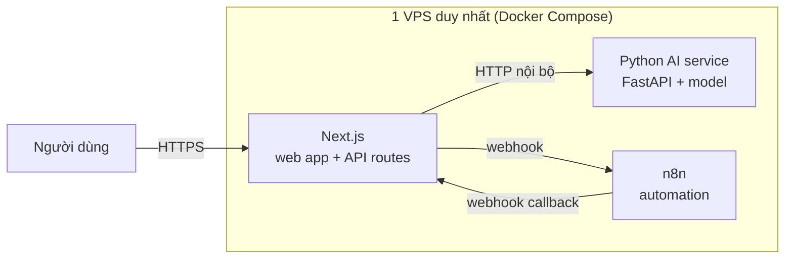

# Quyết định kiến trúc: Backend & hướng tích hợp AI/n8n

Tài liệu này giải thích **vì sao** ANSER Web v2 dùng Next.js fullstack (không tách
Node.js backend riêng, không dùng Flask làm backend chính), và **hướng làm/deploy**
cho 2 phần sẽ tách rời: AI tự train và n8n.

## 1. Quyết định

```
Web app (UI + backend logic)  →  Next.js fullstack (1 project, Route Handlers)
AI tự train                    →  Service Python riêng, gọi qua HTTP
n8n (automation)                →  Service riêng (self-host), gọi qua webhook
```

Không dùng: Node.js/Express làm backend tách riêng. Không dùng: Flask/Python
làm backend chính cho web app.

## 2. Vì sao không tách Node.js (Express) làm backend riêng

Project **từng** tách 2 phần: `frontend` (Next.js) + `backend` (Express), giao
tiếp qua REST API chéo-origin. Đã gộp lại thành 1 Next.js fullstack vì:

| Vấn đề khi tách 2 project Node | Sau khi gộp |
|---|---|
| Cần cấu hình CORS, `credentials: "include"` cho mọi request | Không cần — cùng origin |
| Cookie đăng nhập phải xử lý `SameSite`/domain phức tạp hơn | Cookie set/đọc trực tiếp trong Route Handler |
| 2 `package.json`, 2 lệnh `npm run dev`, 2 lần deploy | 1 project, 1 lệnh, 1 lần deploy |
| Không chia sẻ type giữa FE/BE | TypeScript dùng chung types cho cả UI và API |

**Kết luận**: Express không cho tính năng gì mạnh hơn Route Handlers của Next.js
cho các API CRUD/auth thông thường — tách riêng chỉ thêm việc vận hành, không
thêm năng lực.

## 3. Vì sao không dùng Flask làm backend chính

So sánh theo từng nhóm tính năng của 1 web app hoàn thiện (dashboard, auth, form,
landing, real-time, xử lý dữ liệu nặng):

| Nhóm tính năng | Bên mạnh hơn | Vì sao |
|---|---|---|
| UI dashboard, form tương tác | **Next.js** | React re-render tức thời; Flask+Jinja phải load lại trang, hoặc phải nhúng React vào — mất luôn lợi thế "thuần Flask" |
| Landing page (SEO, tốc độ) | **Next.js** | Server-render sẵn HTML tối ưu SEO/tốc độ tải |
| CRUD, auth, business logic | Ngang nhau | Cả 2 làm tốt như nhau, chỉ khác cú pháp |
| Type-safety FE↔BE | **Next.js** | TypeScript dùng chung 1 kiểu dữ liệu; Python không tự đồng bộ với JS phía UI |
| Real-time (thông báo, dashboard tự cập nhật) | **Next.js** | SSE/WebSocket dễ làm trong Route Handler; Flask cần thêm Flask-SocketIO |
| Deploy đơn giản | **Next.js** | 1 project, 1 lần deploy; Flask muốn UI hiện đại buộc phải tách frontend riêng → lại thành 2 project |
| Xử lý dữ liệu/ML nặng (dự báo, OCR tự train) | **Flask/Python** | pandas, numpy, pytorch, scikit-learn — ecosystem Node không có gì tương đương |
| Background job/cron tính toán nặng | **Flask/Python** | Celery, APScheduler trưởng thành hơn |

**Kết luận**: Flask chỉ thắng ở 2 dòng cuối — đúng phần đã quyết định **tách
riêng thành service độc lập**, không phải lý do để chọn Flask làm backend cho
toàn bộ web.

### Vì sao không "gộp AI vào backend Python luôn cho gọn"

Có ý tưởng: nếu backend chính là Python thì AI/ML nằm chung process, đỡ phải gọi
sang service khác. Nhưng đổi lại:

- Quay lại đúng vấn đề đã gộp — FE (Next.js) + BE (Python) lại là 2 project
  tách biệt, phải xử lý lại CORS/cookie chéo-origin.
- Mất type-safety end-to-end.
- **Model AI nặng vẫn phải tách ra worker riêng dù backend là Python** — vì lý
  do tài nguyên (model load vào RAM/GPU, không thể để mỗi request web server tự
  load lại). Tức là dù chọn Python làm backend, hệ thống nghiêm túc vẫn ra 3
  service như cũ, chỉ đổi vị trí code, không giảm được độ phức tạp vận hành.

Do đó: **giữ Next.js làm backend chính, AI luôn là service riêng** — bất kể
ngôn ngữ backend chính là gì.

## 4. Hướng làm & deploy AI (model tự train)

### Khi nào thêm service này vào

Chỉ thêm khi model tự train đã có kết quả dùng được. Nếu còn đang train/thử
nghiệm, có thể dùng tạm Claude API (Anthropic) cho OCR/trích xuất hóa đơn —
gọi trực tiếp từ Route Handler, không cần tự deploy gì thêm — rồi thay bằng
model tự train khi nó sẵn sàng, không đổi gì phía Next.js ngoài đổi URL gọi.

### Cách làm

1. Đóng gói model thành 1 API nhỏ bằng FastAPI/Flask (chỉ dùng Flask ở vai trò
   **serving layer cho model**, không phải backend web):
   ```python
   # main.py
   from fastapi import FastAPI, UploadFile
   import your_model

   app = FastAPI()

   @app.post("/predict")
   async def predict(file: UploadFile):
       image = await file.read()
       result = your_model.run(image)
       return {"invoice_number": result.number, "total": result.total}
   ```
2. Next.js gọi qua 1 Route Handler mới, không đổi code cũ:
   ```ts
   // app/api/ocr/route.ts
   export async function POST(request: Request) {
     const formData = await request.formData();
     const res = await fetch(`${process.env.AI_SERVICE_URL}/predict`, {
       method: "POST",
       body: formData,
     });
     return Response.json(await res.json());
   }
   ```

### Deploy

| Giai đoạn | Cách deploy | Chi phí ước tính |
|---|---|---|
| Bắt đầu (model chỉ cần CPU) | Đóng gói Docker, chạy chung 1 VPS với n8n qua Docker Compose | ~$6–10/tháng (gộp cả VPS) |
| Khi cần GPU | RunPod, Modal, hoặc AWS/GCP GPU instance riêng | $50–300+/tháng, tính theo giờ chạy |
| Khi traffic lớn, cần scale độc lập | Tách sang platform riêng (Railway/Render) hoặc cluster riêng | Tùy traffic |

**GPU hay không mới là biến số chi phí chính** — không liên quan đến việc có
tách service hay không.

## 5. Hướng làm & deploy n8n

### Cách làm

- Tự host n8n bằng Docker image chính thức (`n8nio/n8n`), không cần viết code
  gì thêm — n8n có UI kéo-thả để dựng workflow.
- Giao tiếp 2 chiều với Next.js qua webhook:
  - **Next.js → n8n**: `fetch(N8N_WEBHOOK_URL)` để kích hoạt 1 workflow (ví dụ:
    "phân tích hóa đơn", "gửi cảnh báo tồn kho").
  - **n8n → Next.js**: n8n gọi lại 1 Route Handler như
    `app/api/webhooks/n8n/route.ts` để trả kết quả sau khi workflow chạy xong
    (tránh chờ đồng bộ, tránh block request).

### Deploy

- Cùng nguyên tắc với AI service: chạy chung 1 VPS qua Docker Compose ở giai
  đoạn đầu để tiết kiệm chi phí (~$6–10/tháng gộp với AI service).
- n8n nhẹ hơn AI service (không cần GPU), thường không cần tách riêng trừ khi
  số lượng workflow/traffic rất lớn.

## 6. Sơ đồ tổng thể (giai đoạn đầu — 1 VPS, Docker Compose)



Về mã nguồn: vẫn là **3 project độc lập** (đúng nguyên tắc tách logic). Về hạ
tầng: **1 server, 1 hóa đơn, 1 chỗ xem log** — giảm gánh vận hành cho team nhỏ.
Khi nào 1 phần cần scale riêng (ví dụ AI cần GPU, hoặc traffic n8n tăng), tách
phần đó ra hạ tầng riêng mà không ảnh hưởng 2 phần còn lại.
